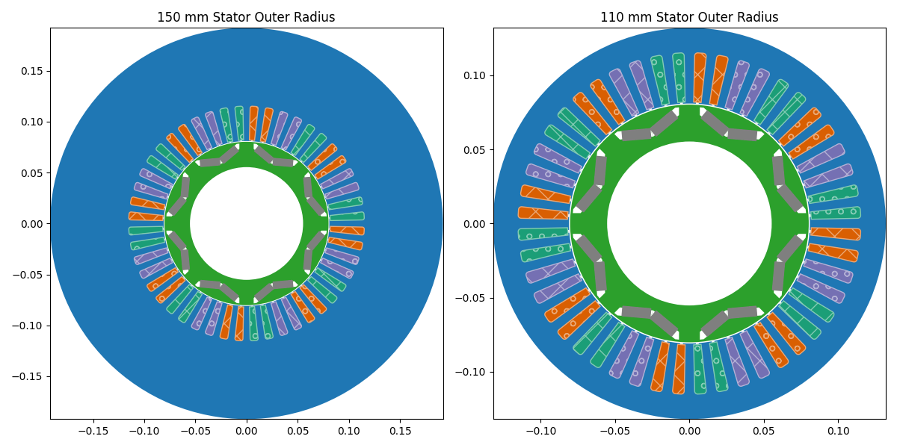

# parameters

The `parameters` attribute of the `Project` class represents the user-defined parameters of the project. These parameters are unit-less values that can be controlled by the user through the [Script](/docs/docs/script) checkpoint in the GUI. Such parameters can be referred to inside the expressions of the [Properties Panel](/docs/docs/main_window#properties-panel).

The other alternative to using the `parameters` attribute is to call `Project.script.parameters` which returns the same dictionary. 

:::info
This attribute is a dictionary where the keys are the parameter names and the values are the parameter values. The `parameters` attribute supports all the features of a standard Python dictionary, including adding, removing, and modifying parameters.
* To add a new parameter, you can simply assign a value to a new key in the dictionary. 
        ```python
    # Add a new parameter
    project.parameters["new_param"] = 42
    ```
* To remove a parameter, you can use the `del` statement.
    ```python
    # Remove a parameter
    del project.parameters["new_param"]
    ```
* To modify an existing parameter, you can assign a new value to the existing key.
    ```python
    # Modify an existing parameter
    project.parameters["existing_param"] = 100
```
:::

## Syntax
```python
Project.parameters : dict[str, object]
```


:::tip[Returns]
- **dict[str, object]**: The user-defined parameters of the project in the form of a dictionary, where the keys are parameter names and the values are their corresponding values.
:::

## Example Usage
In the following example, we demonstrate how to add a new parameter to the project, assign it to the stator's outer diameter, reassign a new value to it, and draw the machine geometry in both cases.

```python
import eMotorSolution as ems
from matplotlib import pyplot as plt

# Load an existing project
project = ems.load_project("path/to/your/project.json")

# Add a new parameter
project.parameters["sor"] = 150

# Assign the parameter to the stator's outer radius
project.machine.dimension.set_stator_outer_radius("sor", "mm")

# Show the machine geometry with sor = 150 mm
fig, ax = plt.subplots(1, 2, figsize=(12, 6))
ax[0].set_title("150 mm Stator Outer Radius")
project.show(ax=ax[0], legend=False)

# Reassign a new value to the parameter
project.parameters["sor"] = 110

# Show the machine geometry with sor = 110 mm
ax[1].set_title("110 mm Stator Outer Radius")
project.show(ax=ax[1], legend=False)
plt.show()
```

<p class="ems"></p>

