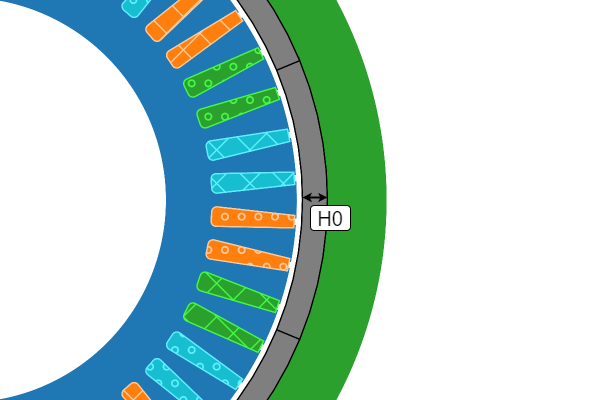
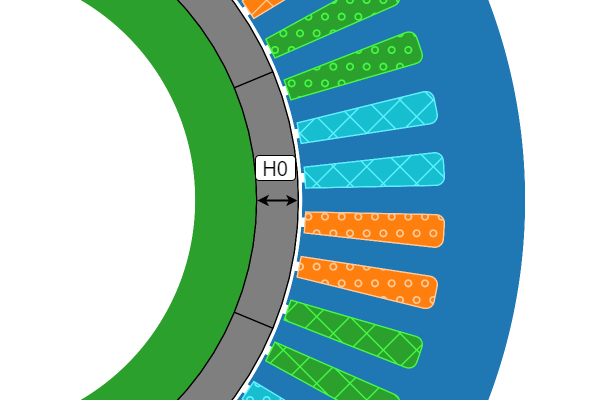

# Ring Magnet

The **Ring Magnet** data class, `SPM_SlotM18Data`, is accessed through the `eMotorSolution.CheckPoints.Rotor.SPMSM.SPM_SlotM18Data` module. 

:::tip[Parameters]
- **H0_expression**: `str | float` The string mathematical expression or a float value for `H0`.
- **H0_unit**: `Literal["m", "dm", "cm", "mm", "in", "ft"]` The unit of the `H0`. Default is `"m"`.
:::

## Methods
| Method | Description |
|--------|-------------|
| set_H0(expression, unit) | Sets the `expression: str \| float` and `unit: Literal["m", "dm", "cm", "mm", "in", "ft"]` for `H0`. |
| validate() | Returns the validation status in dictionary format. |

## Attributes
| Attribute | Description |
|---|---|
| H0 | `float` Returns the evaluated value of `H0` in `m`. :warning: *read-only* |
| hints | `dict[str, float]` Returns the hints for the slot in `m`. :warning: *read-only* |
