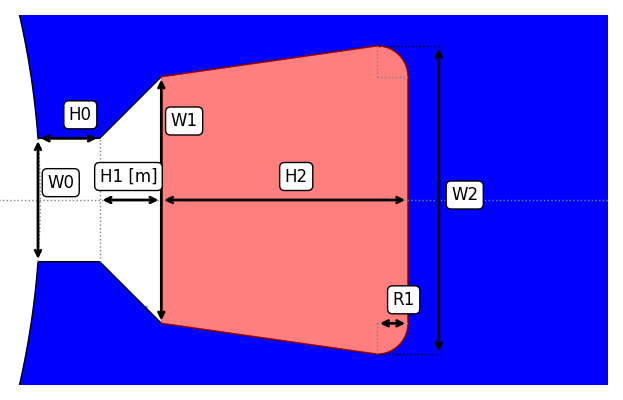

The `SlotUserDefData` is accessed through the `eMotorSolution.CheckPoints.Stator.slots.slotUserDef` module.

Please check the [Stator Slot User Defined](/docs/docs/Extras/user_defined_stator_slot) documentation for more details on how to use this slot type.

:::tip[Parameters]
- **points_expression**: `str | float` The string mathematical expression or stator slot dictionary template for `points`.
- **connections_expression**: `str | float` The string mathematical expression or stator slot dictionary template for `connections`.
:::

## Methods
| Method | Description |
|--------|-------------|
| set_points(expression) | Sets the `expression: str \| dict` for `points`. |
| set_connections(expression) | Sets the `expression: str \| dict` for `connections`. |
| validate() | Returns the validation status in dictionary format. |

## Attributes
| Attribute | Description |
|---|---|
| points | `dict[str, float]` Returns the evaluated points in `m`. :warning: *read-only* |
| connections | `dict[str, float]` Returns the evaluated connections in `m`. :warning: *read-only* |
| winding_area | `float` Returns the area of the slot in `m^2`. :warning: *read-only* |
| wedge_area | `float` Returns the area of the wedge in `m^2`. :warning: *read-only* |
| total_area | `float` Returns the total area of the slot in `m^2`. :warning: *read-only* |
| hints | `dict[str, float]` Returns the hints for the slot in `m`. :warning: *read-only* |
