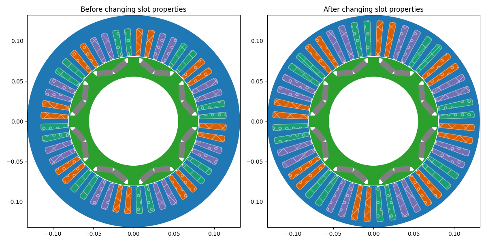
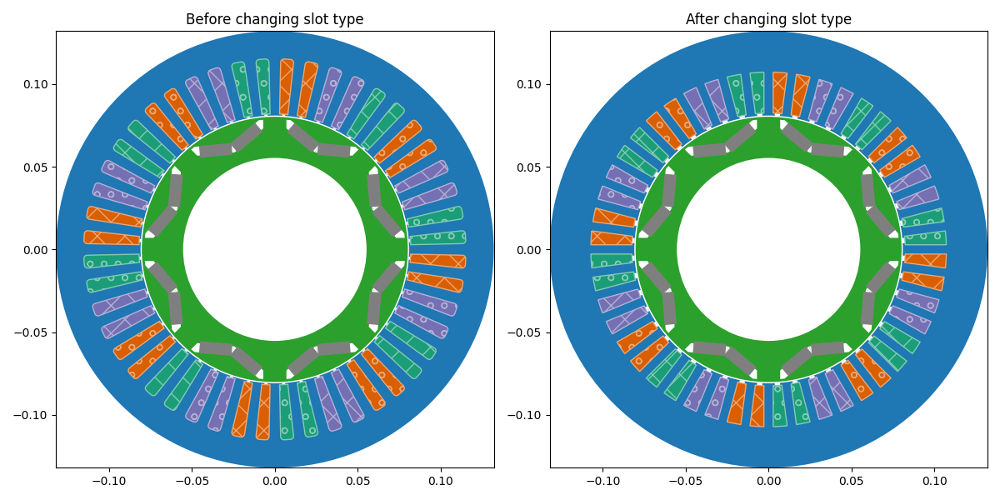

# slot

This is the API representing the stator slot in the GUI [here](/docs/docs/Stator/Slot). It is an instance of `SlotsData` accessed through the `eMotorSolution.CheckPoints.Stator.Slots` module.

This module specifies the number of slots, slot type and its dimensions, and wedge properties.

## Slot Types
The following slot types are available:
* [Type111](/docs/api/Stator/slot/Type111)
* [Type112](/docs/api/Stator/slot/Type112)
* [Type113](/docs/api/Stator/slot/Type113)
* [Type114](/docs/api/Stator/slot/Type114)
* [Type141](/docs/api/Stator/slot/Type141)
* [Type142](/docs/api/Stator/slot/Type142)
* [Type151](/docs/api/Stator/slot/Type151)
* [Type161](/docs/api/Stator/slot/Type161)
* [Type171](/docs/api/Stator/slot/Type171)
* [Type181](/docs/api/Stator/slot/Type181)
* [Type211](/docs/api/Stator/slot/Type211)
* [Type212](/docs/api/Stator/slot/Type212)
* [Type231](/docs/api/Stator/slot/Type231)
* [Type232](/docs/api/Stator/slot/Type232)
* [Type233](/docs/api/Stator/slot/Type233)
* [Type234](/docs/api/Stator/slot/Type234)
* [Type251](/docs/api/Stator/slot/Type251)
* [Type252](/docs/api/Stator/slot/Type252)
* [Type261](/docs/api/Stator/slot/Type261)
* [Type271](/docs/api/Stator/slot/Type271)
* [Type301](/docs/api/Stator/slot/Type301)
* [User Defined](/docs/api/Stator/slot/UserDefined)

:::tip[Parameters]
- **slot_number_expression**: `str | int` The slot number expression, which can be either a string or an integer.
- **slot_props**: Properties of the selected slot type.
- **wedge**: `bool` Whether the stator slot has a wedge or not. Default is `False`.
- **wedge_material**: `str` The name of the wedge material. It should be one of the non-magnet materials in the project's materials collection. Default is `Air`.
:::

## Methods
| Method | Description |
|--------|-------------|
| set_slot_number(expression) | Sets the `expression: str \| int` for `slot_number`. |
| set_slot_type(name) | Sets the `name: str` for `slot_type`. |
| set_wedge_material(material_name) | Sets the `material_name: str` for `wedge_material`. It should be one of the non-magnet materials in the project's materials collection. |
| validate() | Returns the validation status in dictionary format. |

## Attributes
| Attribute | Description |
|-----------|-------------|
| slot_number | `int` The number of slots in the stator. :warning: *read-only* |
| slot_type | `str` Returns the name of the slot type. :warning: *do not set this attribute directly. Use the `set_slot_type` method instead.* |
| slot_props | The properties of the selected slot type. |
| wedge | `bool` Set or get whether the stator slot has a wedge or not. |
| wedge_material | `str` Returns the name of the wedge material. |

## Example Usages

1. The following example demonstrates how to change the slot properties:
```python
import eMotorSolution as ems
from eMotorSolution.CheckPoints.Stator.slots.slot111 import Slot111Data
from matplotlib import pyplot as plt

# load an existing project
project = ems.load_project("path/to/your/project.json")

# Show the current machine geometry
fig, ax = plt.subplots(1, 2, figsize=(12, 6))
ax[0].set_title("Before changing slot properties")
project.show(ax=ax[0], legend=False)

# Access the stator slot data
# Assuming the slot type is Type111, we can access the slot properties
slot: Slot111Data = project.stator.slot.slot_props

# Change the H2 length
current_H2 = slot.H2 # Get the current H2 length in m
slot.set_H2(1.3 * current_H2) # default is in m

# Show the machine geometry after changing the slot properties
ax[1].set_title("After changing slot properties")
project.show(ax=ax[1], legend=False)
plt.show()
```

<p class="ems"></p>

2. The following example demonstrates how to change the slot type:
```python
import eMotorSolution as ems
from eMotorSolution.CheckPoints.Stator.slots.slot251 import Slot251Data
from matplotlib import pyplot as plt

# load an existing project
project = ems.load_project("path/to/your/project.json")

# Show the current machine geometry
fig, ax = plt.subplots(1, 2, figsize=(12, 6))
ax[0].set_title("Before changing slot type")
project.show(ax=ax[0], legend=False)

# Change the slot type to Type251
project.stator.slot.set_slot_type("Type251", set_hints=True)

# Print the slot properties after changing the slot type
slot: Slot251Data = project.stator.slot.slot_props
print(
    {
        "W3": slot.W3,
        "W4": slot.W4,
        "H1": slot.H1,
        "H2": slot.H2,
    }
)

# Show the machine geometry after changing the slot type
ax[1].set_title("After changing slot type")
project.show(ax=ax[1], legend=False)
plt.show()
```
<p class="ems"></p>