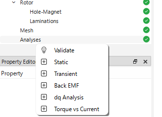
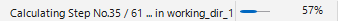

# 無負荷解析

## 解析の目的
無負荷解析は、永久磁石同期モータ（PMSM）における逆起電力（無負荷誘起電圧：Back EMF）を評価するための解析で，基本特性の把握を目的としています。無負荷状態で回転子を回転させることで、各相の誘起電圧波形を取得し、モータの性能特性を把握します。同時に，コギングトルク波形も取得できます。

:::info
無負荷誘起電圧波形を得るために，解析手順として①静磁界解析➡②トランジェント（過渡）解析を実行します。解析結果として出力されるのはトランジェント解析の結果です。
:::

## Back EMFの作成
無負荷解析を追加するには、プロジェクトツリー内の `Analysis` マイルストーンを右クリックし、`Back EMF` を選択します。これにより、`Analysis` マイルストーンの下にユニークな名前を持つ無負荷解析ノードが作成されます。プロジェクトディレクトリ内には指定された名前の新しいフォルダが作成され、EMSolution 用の入力制御ファイル（JSON形式）が生成されます。

プロジェクトウィンドウにも新しいタブが追加され、解析名が表示されます。このタブには以下のサブセクションが含まれます：

* **Input Control**（入力制御）: このタブには JSON 形式の入力制御ファイルが表示されます。ユーザーはこのタブ内で直接ファイルを編集することができます。また、このタブには `Run`（実行）および `Terminate`（中止）ボタンがあり、EMSolution の実行や中止が可能です。

* **JSON View**（JSONビュー）: このビューでは解析フォルダ内のすべての JSON ファイルを読み取り専用で表示します。入力制御ファイル、メッシュファイル、その他関連ファイルを参照できます。

解析チェックポイントを右クリックし、表示されるコンテキストメニューからリネーム、削除、検証、フォルダの表示などの操作を行うことができます。

## 解析条件の設定

無負荷解析の設定には以下があります：

- `Rotor Position`（ロータ初期位置）はロータの初期位置を指定します。このとき，角度はd軸（ロータ磁石のN極の方向）とU相巻線のなす角であり、電気角となります。単位は`deg`です。
- `Rotor Speed`（回転速度）はロータの回転速度を指定します。単位は`rpm`です。
- `Delta Time`（時間ステップ）はトランジェント解析における時間ステップを指定します。単位は`sec`です。
- `Number of Steps`（ステップ数）はトランジェント解析における時間ステップの総数を指定します。

`Rotor Speed`を設定し，`Print Sliding Mesh Properties`ボタンを押すことで，ロータの回転速度に基づいた時間ステップとステップ数の目安がそれぞれのパラメータに設定され，コンソールにも表示されます。
`Delta Time`の値は機械角一度/１ステップとして設定され，`Number of Steps`の値は電気角120度分のステップ数として設定されます。

:::info
モータ解析では、通常、回転数と極数に基づいて時間ステップとステップ数を設定します。例えば、回転数N*rpm*、極数pの場合、1電気周期の時間はT=(p/2)*(N\/60)=pN\/120であり、これに基づいて `Delta Time` と `Number of Steps` を決定します。
:::

## 解析の実行

解析を実行するには、対応する解析タブ内の `Run` ボタンをクリックするか、プロジェクトツリー内の解析チェックポイントを右クリックして `Run` を選択します。解析が実行され、結果は対応するフォルダ内に保存されます。

計算状況は，ウィンドウ右下のプログレスバーに表示されます。
計算が終了すると，プログレスバーが完了を示し，コンソールに終了メッセージが表示されます。

:::warning
解析を実行する前に、eMotorSolution は対応するフォルダ内にメッシュファイルが存在するかを確認します。メッシュファイルが存在しない場合は、`Mesh` フォルダからコピーされます。存在する場合は、既存のメッシュファイルがそのまま使用されます。

メッシュファイルを変更した場合は、既存のメッシュファイルを削除することを推奨します。これにより、最新のメッシュファイルを用いた解析が確実に行われます。削除するには、プロジェクトツリー内の解析チェックポイントを右クリックし、`Purge > Purge All` を選択します。

また、`Purge > Purge Solutions` オプションを使用すると、メッシュファイルを削除せずに、すべての解ファイル（ソリューションファイル）のみを削除できます。これは、メッシュファイルを保持したまま古い解析結果を削除してディスク容量を確保したい場合に有効です。

:::

## 解析結果の確認

解析チェックポイントを右クリックし、`Plot Field` または `Plot Output` を選択することで、フィールド結果および出力結果を表示できます。フィールド結果と出力結果は `Plot` タブにそれぞれ表示されます。内蔵のプロットツールを使用して、結果の可視化が可能です。

- `Plot Field` オプションでは、磁界分布やその他のフィールドデータを表示できます。これにより、モータ内部の磁束密度分布やその他の物理量を視覚的に確認できます。
- 

- `Plot Output` オプションでは、無負荷誘起電圧波形やコギングトルク波形などの出力データを表示できます。これにより、モータの性能特性を評価できます。
下の画面から表示したいデータを選択すると，右側のグラフ領域に表示されます。 `Apply` ボタンを押すと，選択したデータがメインウィンドウにプロットされます。例えば、U相、V相、W相の無負荷誘起電圧波形やコギングトルク波形を確認できます。

:::info
無負荷誘起電圧波形は、dq変換された波形も表示できます。これにより、モータの制御特性をより詳細に分析できます。
dq変換は，ロータの初期位置がd軸（ロータ磁石のN極の方向）とU相巻線のなす角である電気角に基づいて行われます。`Print Sliding Mesh Properties`ではd軸とU相巻線が一致する角度を `Rotor Position` の値として出力します。
:::