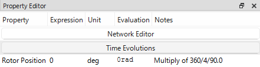

# 静磁界解析テスト

## 解析の目的

静磁界解析は、一ステップのみの解析を行える機能で、計算条件の確認や計算時間を把握するために用意されたものです。
モータ特性を評価する場合，`Back EMF`や`DQ Analysis`、`Torque_vs_Current`解析を使用してください。

## Static の作成

静磁界解析（静解析過渡解析）を追加するには、プロジェクトツリー内の `Analysis` マイルストーンを右クリックし、`Static` を選択します。これにより、`Analysis` マイルストーンの下にユニークな名前を持つ静磁界解析ノードが作成されます。プロジェクトディレクトリ内には指定された名前の新しいフォルダが作成され、EMSolution 用の入力制御ファイル（JSON形式）が生成されます。

プロジェクトウィンドウにも新しいタブが追加され、解析名が表示されます。このタブには以下のサブセクションが含まれます：

* **Input Control**（入力制御）: このタブには JSON 形式の入力制御ファイルが表示されます。ユーザーはこのタブ内で直接ファイルを編集することができます。また、このタブには `Run`（実行）および `Terminate`（中止）ボタンがあり、EMSolution の実行や中止が可能です。
* **JSON View**（JSONビュー）: このビューでは解析フォルダ内のすべての JSON ファイルを読み取り専用で表示します。入力制御ファイル、メッシュファイル、その他関連ファイルを参照できます。

解析チェックポイントを右クリックし、表示されるコンテキストメニューからリネーム、削除、検証、フォルダの表示などの操作を行うことができます。

## ネットワークエディタ
**Network Editor**をクリックすると，ポップアップウィンドウで回路構成をテーブル上で編集できます。
デフォルトで電流源とFEM領域コイルが3相Y結線で接続された回路図が設定されています。
通常の3相PMSMなら電流源の値を変更するだけで解析が可能となります。
テーブルは`Type`、`ID`、`Start`、`End`、`Value`、`Identifier`の項目があります。
- `Type`は回路素子の種類をプルアウトメニューから選択します。選択項目には`FEM`（FEM領域に定義されたコイル）、`VPS`（電圧源）、`CPS`（電流源）、`R`（電気抵抗）、`L`（インダクタ）、`C`（キャパシタ）があります。
- `ID`は回路素子内の各素子に割り当てる番号です。各素子は別のIDを持つ必要があります。デフォルトで表の上から順に数値が割り当てられます。
- `Start`と`End`は回路上のノードを指定するための番号です。`Start`が始点、`End`が終点に相当します。
- `Value`はその素子の値か参照するIDを入力します。
    - `FEM`はWindingのIDを入力します。3相の場合，1～3が*U*、*V*、*W*相のWindingに相当します。
    - `VPS`、`CPS`はTime IDを入力します。Time IDは次の項目である**Time Evolutions**で設定します。デフォルトの電流源には1～3が割り当てられており、「Time Evolution」にも対応するデフォルトIDが用意されています。単位はそれぞれ`V`、`A`です。
    - `R`、`L`、`C`は各素子の値を直接入力します。単位はそれぞれ`Ω`、`H`、`F`です。

## 時間関数の設定
**Time Evolutions**は解析内で用いる時間関数を設定します。例えば、**Network Editor**で設定した`CPS`などが対象です。デフォルトで**Network Editor**の`CPS`の*U*、*V*、*W*相に相当するID 1～3が用意されています。テーブルで対象のIDをクリックすると、時間関数を編集できます。`Type`から関数の設定方法を選択します：
- `Described by Equation`は`Proparty`の値を入力して関数を定義します。入力テーブルの下に示された関数を参考に各`Proparty`に対応する値をテーブルで入力してください。
- `Data Table`はテーブル形式で関数を定義します。`TIME_expression`に時間データ、`VALUE_expression`に値データを入力します。
- `Harmonic Time Evolution`は余弦関数（*cos*）の`AMPLITUDE`（振幅）、`TCYCLE`（周期）、`PHASE`（位相）を入力します。

:::info
交流を通電する場合は`Harmonic Time Evolution`を推奨します。同期モータでは周期は回転数と一致している必要があります。
回転数をN*rpm*、極数をpとしたとき、周期T*sec*は以下で求まります：
T=(p/2)*(N\/60)=pN\/120
:::

## 静磁界解析の設定

静磁界解析の設定には以下があります：
- `Rotor Position`（ロータ初期位置）はロータの初期位置を指定します。このとき，角度はd軸（ロータ磁石のN極の方向）とU相巻線のなす角であり、電気角となります。単位は`deg`です。

:::info
時間刻みや回転数はここでは設定しません。ロータを固定した位置における静磁界解析を行います。
:::

## 解析の実行

解析を実行するには、対応する解析タブ内の `Run` ボタンをクリックするか、プロジェクトツリー内の解析チェックポイントを右クリックして `Run` を選択します。解析が実行され、結果は対応するフォルダ内に保存されます。

:::warning
解析を実行する前に、eMotorSolution は対応するフォルダ内にメッシュファイルが存在するかを確認します。メッシュファイルが存在しない場合は、`Mesh` フォルダからコピーされます。存在する場合は、既存のメッシュファイルがそのまま使用されます。

メッシュファイルを変更した場合は、既存のメッシュファイルを削除することを推奨します。これにより、最新のメッシュファイルを用いた解析が確実に行われます。削除するには、プロジェクトツリー内の解析チェックポイントを右クリックし、`Purge > Purge All` を選択します。

また、`Purge > Purge Solutions` オプションを使用すると、メッシュファイルを削除せずに、すべての解ファイル（ソリューションファイル）のみを削除できます。これは、メッシュファイルを保持したまま古い解析結果を削除してディスク容量を確保したい場合に有効です。

:::

## 結果の表示

解析チェックポイントを右クリックし、`Plot Field` または `Plot Output` を選択することで、フィールド結果および出力結果を表示できます。フィールド結果は `Field` タブに、出力結果は `Output` タブにそれぞれ表示されます。内蔵のプロットツールを使用して、結果の可視化が可能です。
