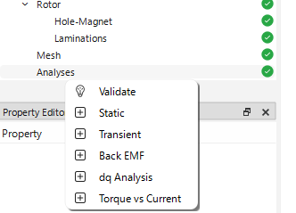
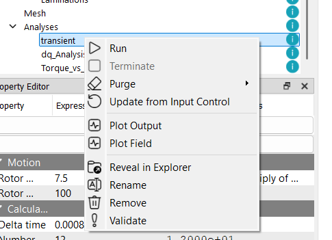
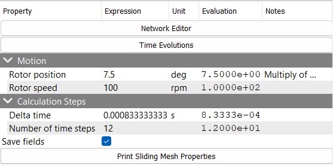

# トランジェント解析

トランジェント解析を追加するには、プロジェクトツリー内の `Analysis` マイルストーンを右クリックし、`Transient` を選択します。これにより、`Analysis` マイルストーンの下にユニークな名前を持つトランジェント解析ノードが作成されます。プロジェクトディレクトリ内には指定された名前の新しいフォルダが作成され、EMSolution 用の入力制御ファイル（JSON形式）が生成されます。

プロジェクトウィンドウにも新しいタブが追加され、解析名が表示されます。このタブには以下のサブセクションが含まれます：

* **Input Control**（入力制御）: このタブには JSON 形式の入力制御ファイルが表示されます。ユーザーはこのタブ内で直接ファイルを編集することができます。また、このタブには `Run`（実行）および `Terminate`（中止）ボタンがあり、EMSolution の実行や中止が可能です。
* **JSON View**（JSONビュー）: このビューでは解析フォルダ内のすべての JSON ファイルを読み取り専用で表示します。入力制御ファイル、メッシュファイル、その他関連ファイルを参照できます。

解析チェックポイントを右クリックし、表示されるコンテキストメニューからリネーム、削除、検証、フォルダの表示などの操作を行うことができます。

## トランジェント解析の設定

<!-- TODO: Sakai-san -->

<!-- TODO: Kaimori-san -->

...

## 解析の実行

解析を実行するには、対応する解析タブ内の `Run` ボタンをクリックするか、プロジェクトツリー内の解析チェックポイントを右クリックして `Run` を選択します。解析が実行され、結果は対応するフォルダ内に保存されます。

:::warning
解析を実行する前に、eMotorSolution は対応するフォルダ内にメッシュファイルが存在するかを確認します。メッシュファイルが存在しない場合は、`Mesh` フォルダからコピーされます。存在する場合は、既存のメッシュファイルがそのまま使用されます。

メッシュファイルを変更した場合は、既存のメッシュファイルを削除することを推奨します。これにより、最新のメッシュファイルを用いた解析が確実に行われます。削除するには、プロジェクトツリー内の解析チェックポイントを右クリックし、`Purge > Purge All` を選択します。

また、`Purge > Purge Solutions` オプションを使用すると、メッシュファイルを削除せずに、すべての解ファイル（ソリューションファイル）のみを削除できます。これは、メッシュファイルを保持したまま古い解析結果を削除してディスク容量を確保したい場合に有効です。

:::

## 結果の表示

解析チェックポイントを右クリックし、`Plot Field` または `Plot Output` を選択することで、フィールド結果および出力結果を表示できます。フィールド結果は `Field` タブに、出力結果は `Output` タブにそれぞれ表示されます。内蔵のプロットツールを使用して、結果の可視化が可能です。
