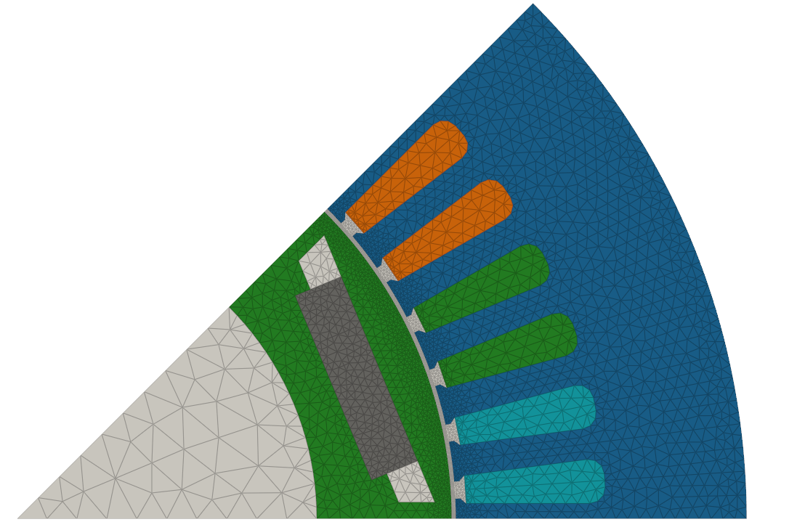

# スライディングメッシュ機構

スライディングメッシュ機構は、回転機におけるロータとステータ間の相互作用をシミュレーションするために使用されます。この機構により、ステータに対するロータの相対的な動きを模擬することが可能となり、電動機や発電機といったアプリケーションにおける高精度な過渡解析が実現されます。

この機構では、ロータはスライディング角に等しい離散的なステップで移動します。スライディング角は、エアギャップラインに沿った接線方向の分割数によって決定されます。これらの分割数は、[メッシュ設定](https://emsolution-ssil.github.io/eMotorSolutionDoc/docs/docs/mesh)のマイルストーンで指定されます。

$$
\begin{align*}
\theta_{\text{sliding}} &= \frac{360^\circ}{\text{接線方向の全分割数}} \\
&= \frac{360^\circ \times \text{メッシュ設定された極数}}{\text{接線方向分割数} \times \text{極数}}
\end{align*}
$$

ロータ角 $\theta_{\text{rotor}}$ はスライディング角の整数倍で表されます。

$$
\theta_{\text{rotor}} = m \cdot \theta_{\text{sliding}} \quad \text{ただし } m \in \mathbb{Z}
$$

# ロータ回転速度とタイムステップ

ロータの回転速度 $N$ は rpm（毎分回転数）で定義されます。最小タイムステップ $\Delta t$ は、ロータ速度とスライディング角に基づいて以下のように計算されます：

$$
\Delta t = \frac{\theta_{\text{sliding}}}{N \times 60}
$$

この式により、最小タイムステップはロータがスライディング角だけ回転するのに対応する時間となり、ロータの動的挙動を高精度にシミュレーションできます。

# 計算例

8極の機械で、ロータ速度が 1000 rpm、1 極をメッシュ設定、接線方向分割数が 90 の場合、スライディング角は：

$$
\theta_{\text{sliding}} = \frac{360^\circ \times 1}{90 \times 8} = 0.5^\circ   
$$

最小タイムステップは次のように計算されます：

$$
\Delta t = \frac{0.5^\circ}{1000 \times 60} = \frac{1}{12} \times 10^{-5} \text{ 秒}
$$

この結果は、シミュレーションにおいてロータが $\Delta t$ 秒ごとに 0.5 度回転することを意味しており、ロータとステータ間の位置関係を高精度で追跡可能にします。

