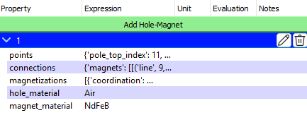
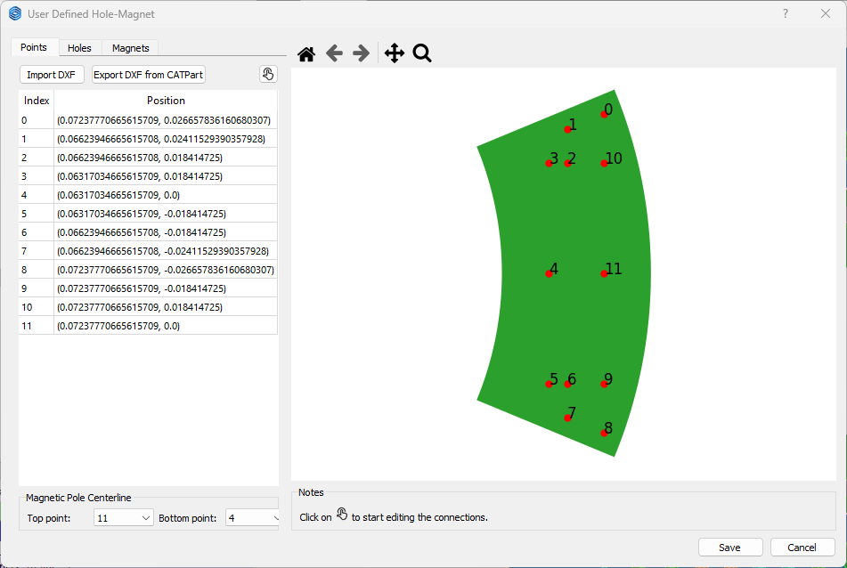
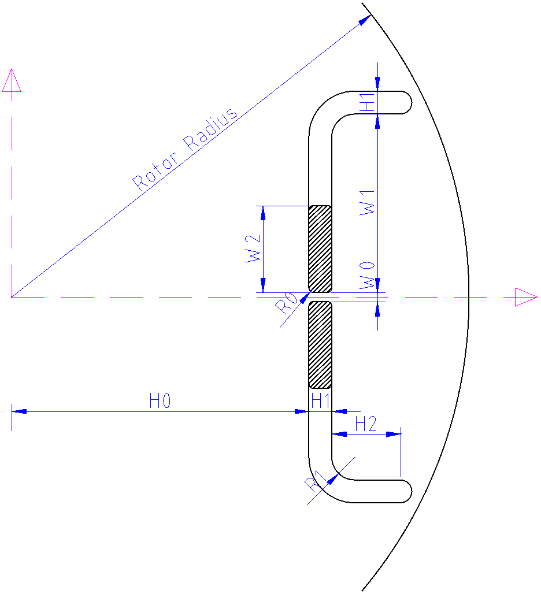
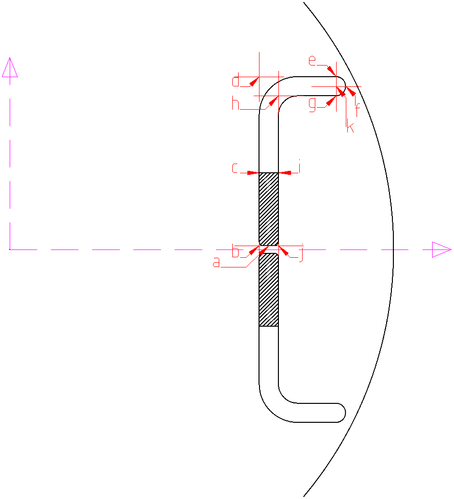

# ユーザー定義埋込永久磁石（IPM）

埋込型永久磁石モータ（IPM）は、複数の穴を持ち、それぞれの穴に複数の永久磁石を配置できます。また、各磁石には個別の磁化方向を設定することが可能です。

ユーザー定義のホール・マグネットは、3つのパラメータ：`Points`、`Connections`、`Magnetization` を使用して構成されます。

<p class="ems"></p>

ユーザー定義のIPMが選択されると、デフォルトで `Hole Type 52` が作成されます。<span style={{ fontFamily: 'Segoe Fluent Icons', fontSize: '1.0em' }}>&#xE70F;</span> **Edit** ボタンをクリックすると、`Points`、`Connections`、`Magnetization` をインタラクティブに編集できるダイアログが表示されます。

<p class="ems"></p>

## Points

`Points` 辞書には、穴および磁石の形状を定義するための座標と、中心線に関連するインデックスが含まれます。テンプレートは以下の通りです：

```python
{
    "points": {
        "point0": [point0_x_coordinate, point0_y_coordinate],
        "point1": [point1_x_coordinate, point1_y_coordinate],
        ...
    },
    "pole_top_index": "point_x",
    "pole_bottom_index": "point_y",
}
````

## Connections

`Connections` 辞書は、`Points` 内の点をどのように接続して穴や磁石の形状を構成するかを定義します。テンプレートは以下の通りです：

```python
{
    "holes": [
        [    # 第1の穴
            ["connection_type", "parameter1", "parameter2", ...],
            ...
        ],
        [    # 第2の穴
            ...
        ],
    ],
    "magnets": [
        [    # 第1の磁石
            ...
        ],
        [    # 第2の磁石
            ...
        ],
    ],
}
```

接続は形状を閉じる必要があり、定義順は反時計回りとします。

## Magnetization（磁化）

`Points` や `Connections` とは異なり、`Magnetization` は磁石ごとの磁化方向を定義する辞書のリストです。各磁石は `cartesian` または `polar` のいずれかの磁化方式を指定できます。

* **cartesian（直交座標系）**：始点と終点で磁化方向を定義
* **polar（極座標系）**：中心点によって放射方向の磁化を定義

```python
[
    {
        "coordination": "cartesian",
        "starting_point": "point_x",
        "ending_point": "point_y",
    },
    {
        "coordination": "polar",
        "polar_center_point": [x_coordinate, y_coordinate],
    },
]
```

## 例

[Script チェックポイント](https://emsolution-ssil.github.io/eMotorSolutionDoc/docs/docs/script) で点や接続を定義することを推奨します。これにより柔軟性が増し、Python 関数も使用可能になります。

以下の例では、2つの穴と2つの磁石を持つIPMを作成します。どちらの磁石も x 方向に同じ磁化方向を持ちます。

<p class="ems"></p>

点と接続は以下の通り定義されます：

<p class="ems"></p>

```python
import ems

H0 = 65e-3  # m
H1 = 4e-3  # m
H2 = 5e-3  # m
W0 = 2e-3  # m
W1 = 20e-3  # m
W2 = 10e-3  # m
R0 = 1e-3  # m
R1 = 3e-3  # m

# 各点の座標を計算
point_a_x = H0 + H1 / 2
point_a_y = W0 / 2
point_b_x = H0
point_b_y = W0 / 2
point_c_x = H0
point_c_y = point_b_y + W2
point_d_x = H0
point_d_y = point_b_y + W1 + H1
point_e_x = H0 + H1 + H2
point_e_y = point_d_y
point_f_x = point_e_x + H1 / 2
point_f_y = point_e_y - H1 / 2
point_g_x = point_e_x
point_g_y = point_e_y - H1
point_h_x = H0 + H1
point_h_y = point_g_y
point_i_x = point_c_x + H1
point_i_y = point_c_y
point_j_x = point_b_x + H1
point_j_y = point_b_y
point_k_x = point_e_x
point_k_y = point_e_y - H1 / 2
point_x_x = H0
point_x_y = 0

# 点の定義
pts = {
    "pole_top_index": "x",
    "pole_bottom_index": "x",
    "points": {
        "a_top": (point_a_x, point_a_y),
        "b_top": (point_b_x, point_b_y),
        "c_top": (point_c_x, point_c_y),
        "d_top": (point_d_x, point_d_y),
        "e_top": (point_e_x, point_e_y),
        "f_top": (point_f_x, point_f_y),
        "g_top": (point_g_x, point_g_y),
        "h_top": (point_h_x, point_h_y),
        "i_top": (point_i_x, point_i_y),
        "j_top": (point_j_x, point_j_y),
        "k_top": (point_k_x, point_k_y),
        "a_bottom": (point_a_x, -point_a_y),
        "b_bottom": (point_b_x, -point_b_y),
        "c_bottom": (point_c_x, -point_c_y),
        "d_bottom": (point_d_x, -point_d_y),
        "e_bottom": (point_e_x, -point_e_y),
        "f_bottom": (point_f_x, -point_f_y),
        "g_bottom": (point_g_x, -point_g_y),
        "h_bottom": (point_h_x, -point_h_y),
        "i_bottom": (point_i_x, -point_i_y),
        "j_bottom": (point_j_x, -point_j_y),
        "k_bottom": (point_k_x, -point_k_y),
        "x": (point_b_x, point_x_y),
    },
}

# 接続定義
cns = {
    "holes": [
        [
            ("fillet", "a_top", "b_top", "c_top", R0),
            ("fillet", "c_top", "d_top", "e_top", R1 + H1),
            ("arc", "e_top", "k_top", "f_top"),
            ("arc", "f_top", "k_top", "g_top"),
            ("fillet", "g_top", "h_top", "i_top", R1),
            ("fillet", "i_top", "j_top", "a_top", R0),
        ],
        [
            ("fillet", "c_bottom", "b_bottom", "a_bottom", R0),
            ("fillet", "a_bottom", "j_bottom", "i_bottom", R0),
            ("fillet", "i_bottom", "h_bottom", "g_bottom", R1),
            ("arc", "g_bottom", "k_bottom", "f_bottom"),
            ("arc", "f_bottom", "k_bottom", "e_bottom"),
            ("fillet", "e_bottom", "d_bottom", "c_bottom", R1 + H1),
        ],
    ],
    "magnets": [
        [
            ("fillet", "a_top", "b_top", "c_top", R0),
            ("line", "c_top", "i_top"),
            ("fillet", "i_top", "j_top", "a_top", R0),
        ],
        [
            ("fillet", "a_bottom", "b_bottom", "c_bottom", R0),
            ("line", "c_bottom", "i_bottom"),
            ("fillet", "i_bottom", "j_bottom", "a_bottom", R0),
        ],
    ],
}

# 磁化方向の定義
mgs = [
    {"coordination": "cartesian", "starting_point": "c_top", "ending_point": "i_top"},
    {
        "coordination": "cartesian",
        "starting_point": "c_bottom",
        "ending_point": "i_bottom",
    },
]

ems.update_parameters(
    {
        "pts": pts,
        "cns": cns,
        "mgs": mgs,
    }
)
```

<a className="button" target="\_blank" href={ require("/UserDefinedIPM.zip").default } download>ユーザー定義IPMプロジェクトをダウンロード</a>

