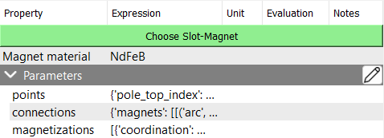
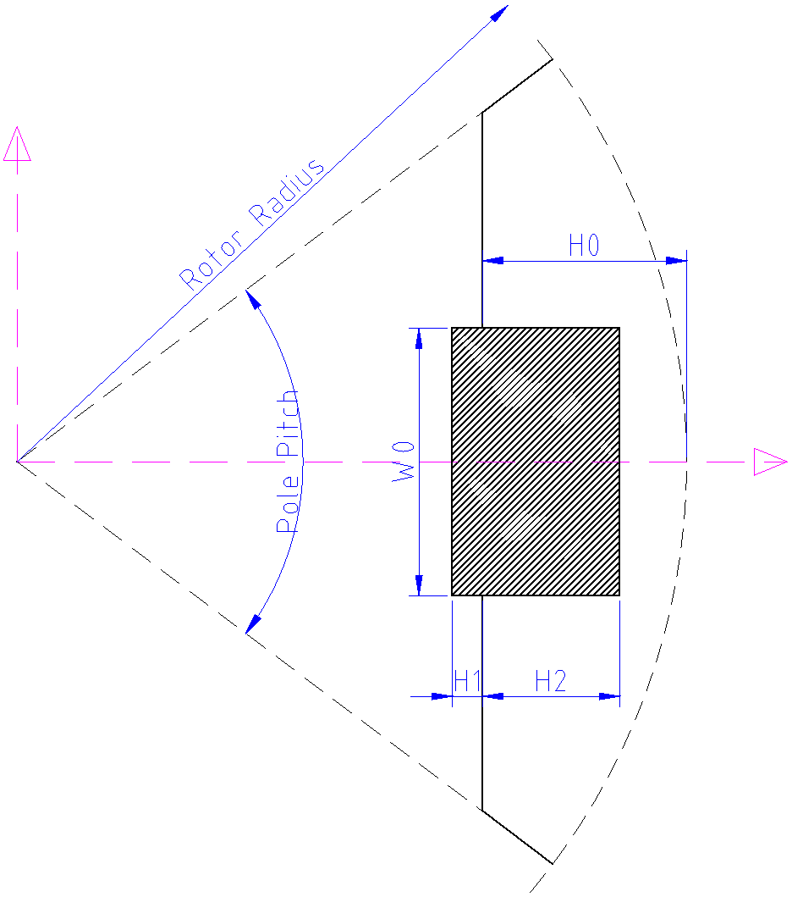
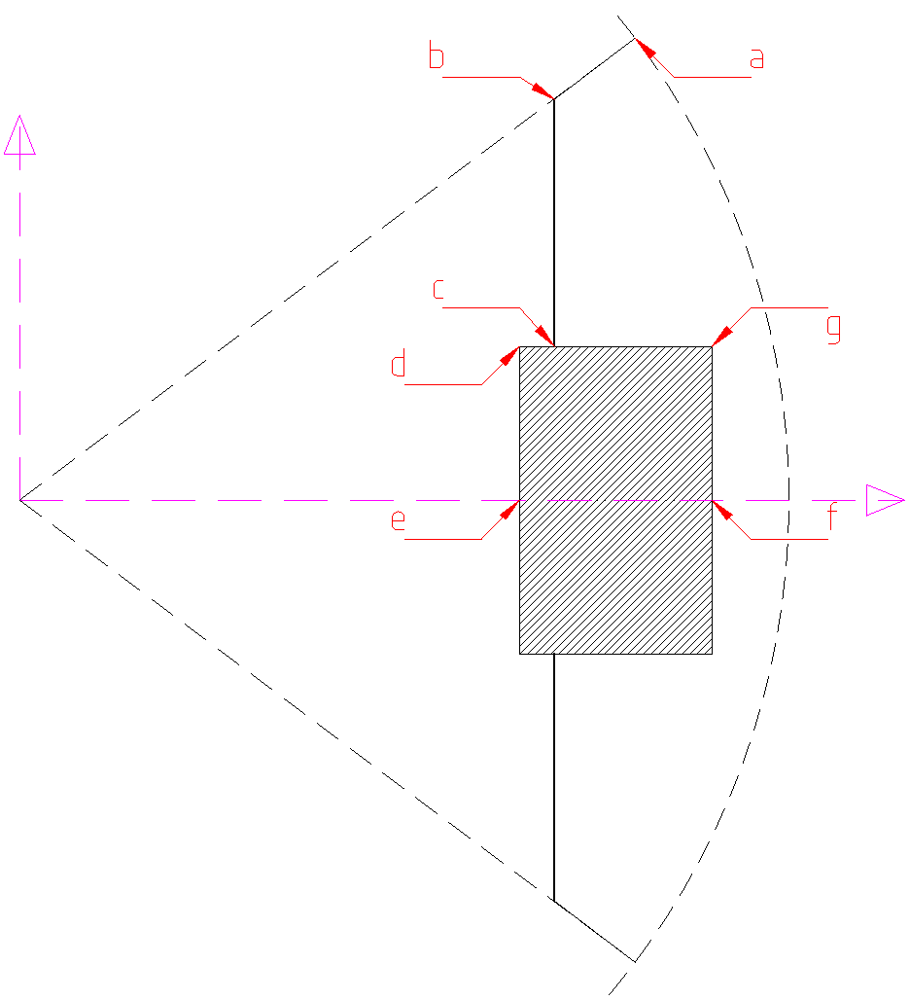

# User Defined Surface Permanent Magnet (SPM)
The surface permanent magnet machines may have multiple slots with multiple permanent magnets in each slot. Each permanent magnet can also have its own magnetization direction.
The user-defined Slot-Magnet, takes three parameters: `Points`, `Connections`, and `Magnetization`.

<p class="ems"></p>

By default, a `SlotM11` is created when a user-defined SPM is selected. By clicking on the <span style={{ fontFamily: 'Segoe Fluent Icons', fontSize: '1.0em' }}>&#xE70F;</span> **Edit** button, a dialog will open where you can edit the `Points`, `Connections`, and `Magnetization` interactively.

<p class="ems"></p>

## Points
The `Points` dictionary contains the coordinates of the points that define the slots and magnets and the index of center-line points. The template for the `Points` dictionary is as follows:

```python
{
    "points": {
        "point0": [point0_x_coordinate, point0_y_coordinate],
        "point1": [point1_x_coordinate, point1_y_coordinate],
        ...
    },
    "pole_top_index": "point_x",
    "pole_bottom_index": "point_y",
}
```

:::warning
The following remarks should be strictly followed:
- The slot should be aligned with the x-axis.
- Point coordinates should be given in meters.
- The keys in the `points` dictionary should be unique strings that represent the point names. Other keys like integer or float values are not allowed.
:::

## Connections
The `Connections` dictionary defines how the points in the `Points` dictionary are connected to form the slot and magnet geometries. SPM usually have a single slot-magnet combination, but for more complex designs, it can have multiple slots and magnets. The template for the `Connections` dictionary is as follows:

```python
{
    "slots": [
        [   # First slot
            ["connection_type", "parameter1", "parameter2", ...],
            ["connection_type", "parameter1", "parameter2", ...], 
        ],
        [   # Second slot
            ["connection_type", "parameter1", "parameter2", ...],
            ["connection_type", "parameter1", "parameter2", ...], 
        ],
    ],
    "magnets": [
        [   # First magnet
            ["connection_type", "parameter1", "parameter2", ...],
            ["connection_type", "parameter1", "parameter2", ...], 
        ],
        [   # Second magnet
            ["connection_type", "parameter1", "parameter2", ...],
            ["connection_type", "parameter1", "parameter2", ...], 
        ],
    ]
}
```

The connections should close the geometry of the slot and windings. And the sequence of the connections should be in counter-clockwise direction.

:::info
Currently, the following connection types are supported:
- `line`: Connects two points with a straight line. **Syntax**: `("line", "point1", "point2")`
- `arc`: Connects two points with an arc. **Syntax**: `("arc", "start_point", "center_point", "end_point")`
- `arc3p`: Connects two points with an arc defined by three points. **Syntax**: `("arc3p", "start_point", "middle_point", "end_point")`
- `fillet`: Connects two lines with a fillet. **Syntax**: `("fillet", "point1", "intersection_point", "point2", radius)`
:::

## Magnetization
In contrast to `points` and `connections`, the `magnetization` is a list of dictionaries, where each dictionary defines the magnetization direction for the magnets defined in `connections`. Each magnet can have its own magnetization type, `cartesian` or `polar`. In case of `cartesian`, the magnetization is defined by a starting and ending point, while in case of `polar`, the magnetization is defined by the `polar_center_point`.

```python
[
    {
        "coordination": "cartesian",
        "starting_point": "point_x",
        "ending_point": "point_y",
    },
    {
        "coordination": "polar",
        "polar_center_point": [x_coordinate, y_coordinate],
    },
]
```

## Example
It is recommanded to define the points and connections in [Script](https://emsolution-ssil.github.io/eMotorSolutionDoc/docs/docs/script) checkpoint, since it gives more flexibility and allows to use python functions.

In this example, we will create a user-defined IPM with two holes and two magnets, where both magnets have the same magnetization direction in x-direction.

<p class="ems"></p>

The points and connections are defined as follows:

<p class="ems"></p>

```python
import ems
import numpy as np

stator_inner_radius = 80.95e-3  # m
n_poles = 8

h0 = 30e-3  # m
w0 = 15e-3  # m
h1 = 2e-3  # m
h2 = 10e-3  # m

pole_pitch = 2 * np.pi / n_poles

pa_x = stator_inner_radius * np.cos(pole_pitch / 2)
pa_y = stator_inner_radius * np.sin(pole_pitch / 2)

pb_x = stator_inner_radius - h0
pb_y = np.sqrt(stator_inner_radius**2 - pb_x**2)

pc_x = pb_x
pc_y =  w0 / 2

pd_x = pc_x - h1
pd_y = pc_y

pe_x = pd_x
pe_y = 0

pf_x = pe_x + h1 + h2
pf_y = 0

pg_x = pf_x
pg_y = pc_y
pts = {
    "points": {
        "a_top": (pa_x, pa_y),
        "b_top": (pb_x, pb_y),
        "c_top": (pc_x, pc_y),
        "d_top": (pd_x, pd_y),
        "e": (pe_x, pe_y),
        "f": (pf_x, pf_y),
        "g_top": (pg_x, pg_y),
        "a_bottom": (pa_x, -pa_y),
        "b_bottom": (pb_x, -pb_y),
        "c_bottom": (pc_x, -pc_y),
        "d_bottom": (pd_x, -pd_y),
        "g_bottom": (pg_x, -pg_y),
    }
    "pole_top_index": "f",
    "pole_bottom_index": "e",
}

