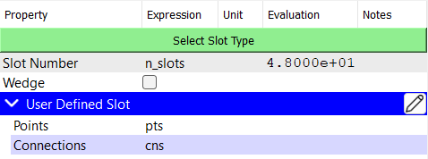
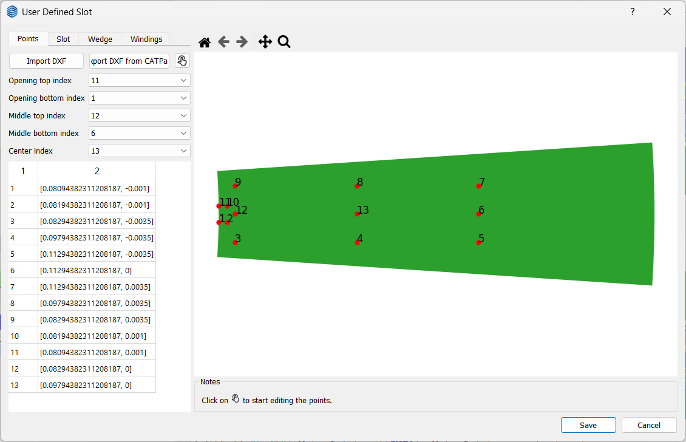
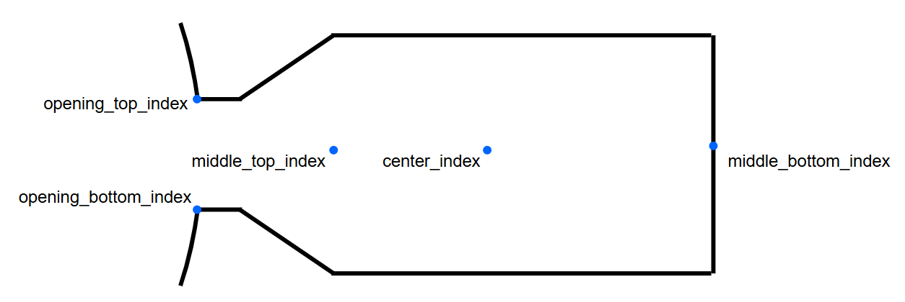
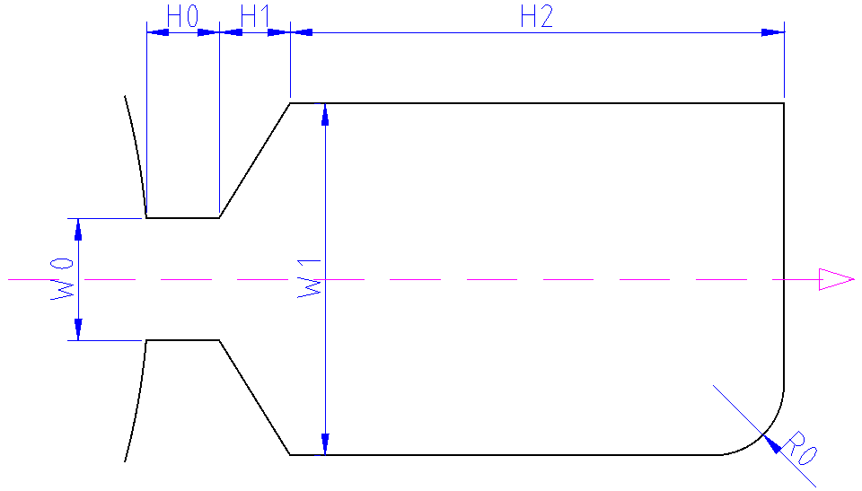
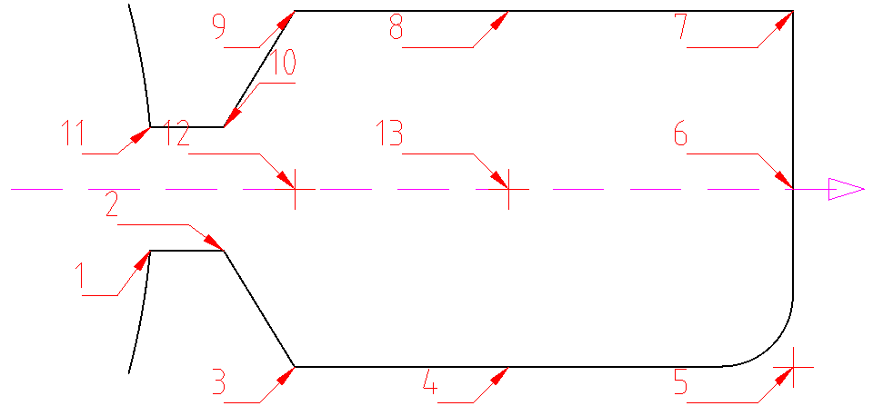

# User Defined Stator Slot
User defined stator slots take two parameters: `Points` and `Connections`. They are python dictionaries that define the geometry of the stator slot, wedge and different styles of windings. The `Points` dictionary contains the coordinates of the points that define the slot geometry, while the `Connections` dictionary defines how these points are connected to form the slot.

<p class="ems"></p>

By default, a `SlotType111` is created when a user defined stator slot is selected. By clicking on the <span style={{ fontFamily: 'Segoe Fluent Icons', fontSize: '1.0em' }}>&#xE70F;</span>**Edit** button, a dialog will open where you can edit the `Points` and `Connections` interactively. 

<p class="ems"></p>

## Points
The `Points` dictionary contains the coordinates of the points that define the slot geometry and the index of important points. The template for the `Points` dictionary is as follows:

```python
{
    "points": {
        "point0": [point0_x_coordinate, point0_y_coordinate],
        "point1": [point1_x_coordinate, point1_y_coordinate],
        ...
    },
    "opening_top_index": "point_a",
    "opening_bottom_index": "point_b",
    "middle_bottom_index": "point_c",
    "middle_top_index": "point_d",
    "center_index": "point_e",
}
```

:::warning
The following remarks should be strictly followed:
- The slot should be aligned with the x-axis.
- Point coordinates should be given in meters.
- The keys in the `points` dictionary should be unique strings that represent the point names. Other keys like integer or float values are not allowed.
- The `opening_top_index`, `opening_bottom_index`, `middle_bottom_index`, `middle_top_index`, and `center_index` should refer to the keys in the `points` dictionary according to the following rules:
  - `opening_top_index`: The point at the top of the slot opening. The distance from the origin should be exactly equal to the stator inner radius.
  - `opening_bottom_index`: The point at the bottom of the slot opening. The distance from the origin should be exactly equal to the stator inner radius.
  - `middle_bottom_index`: The point at the bottom of the slot. This point is used for concentrated winding. The y-coordinate should be equal to zero.
  - `middle_top_index`: The point at the top of the slot. The y-coordinate should be equal to zero.
  - `center_index`: The center point of the slot. The y-coordinate should be equal to zero.
:::
<p class="ems"></p>

## Connections
The `Connections` dictionary defines how the points in the `Points` dictionary are connected to form the slot geometry and different styles of windings. The template for the `Connections` dictionary is as follows:

```python
{
    "slot": [
      ["connection_type", "parameter1", "parameter2", ...],
      ["connection_type", "parameter1", "parameter2", ...], 
    ],
    "wedge": [
      ["connection_type", "parameter1", "parameter2", ...],
      ["connection_type", "parameter1", "parameter2", ...], 
    ],
    "single_layer_winding": [
      ["connection_type", "parameter1", "parameter2", ...],
      ["connection_type", "parameter1", "parameter2", ...], 
    ],
    "top_winding": [
      ["connection_type", "parameter1", "parameter2", ...],
      ["connection_type", "parameter1", "parameter2", ...], 
    ],
    "bottom_winding": [
      ["connection_type", "parameter1", "parameter2", ...],
      ["connection_type", "parameter1", "parameter2", ...], 
    ],
    "left_winding": [
      ["connection_type", "parameter1", "parameter2", ...],
      ["connection_type", "parameter1", "parameter2", ...], 
    ],
    "right_winding": [
      ["connection_type", "parameter1", "parameter2", ...],
      ["connection_type", "parameter1", "parameter2", ...], 
    ],
}
```
The connections should close the geometry of the slot and windings. And the sequence of the connections should be in counter-clockwise direction.

:::info
Currently, the following connection types are supported:
- `line`: Connects two points with a straight line. **Syntax**: `("line", "point1", "point2")`
- `arc`: Connects two points with an arc. **Syntax**: `("arc", "start_point", "center_point", "end_point")`
- `arc3p`: Connects two points with an arc defined by three points. **Syntax**: `("arc3p", "start_point", "middle_point", "end_point")`
- `fillet`: Connects two lines with a fillet. **Syntax**: `("fillet", "point1", "intersection_point", "point2", radius)`
:::

## Example
It is recommanded to define the points and connections in [Script](https://emsolution-ssil.github.io/eMotorSolutionDoc/docs/docs/script) checkpoint, since it gives more flexibility and allows to use python functions. 

Here is an example of a user defined stator slot with the following shape:

<p class="ems"></p>

<p class="ems"></p>


```python
import ems
import numpy as np

stator_inner_radius = 80.95e-3  # m
n_slots = 48

w0 = 2e-3  # m
h0 = 1e-3  # m

h1 = 1e-3  # m

w1 = 5e-3  # m
h2 = 30e-3  # m

r0 = 0.5e-3  # m

p1_y = -w0 / 2
p1_x = np.sqrt(stator_inner_radius**2 - p1_y**2)

p2_x = p1_x + h0
p2_y = p1_y

p3_x = p2_x + h1
p3_y = p2_y - w1 / 2

p4_x = p3_x + h2 / 2
p4_y = p3_y

p5_x = p4_x + h2 / 2
p5_y = p4_y

p6_x = p5_x
p6_y = 0

pts = {
    "points": {
        "1": (p1_x, p1_y),
        "2": (p2_x, p2_y),
        "3": (p3_x, p3_y),
        "4": (p4_x, p4_y),
        "5": (p5_x, p5_y),
        "6": (p6_x, p6_y),
        "7": (p5_x, -p5_y),
        "8": (p4_x, -p4_y),
        "9": (p3_x, -p3_y),
        "10": (p2_x, -p2_y),
        "11": (p1_x, -p1_y),
        "12": (p3_x, 0),
        "13": (p4_x, 0),
    },
    "opening_top_index": "11",
    "opening_bottom_index": "1",
    "middle_bottom_index": "6",
    "middle_top_index": "12",
    "center_index": "13",
}

cns = {
    "slot": [
        ("line", "1", "2"),
        ("line", "2", "3"),
        ("line", "3", "4"),
        ("fillet", "4", "5", "6", r0),
        ("line", "6", "7"),
        ("line", "7", "8"),
        ("line", "8", "9"),
        ("line", "9", "10"),
        ("line", "10", "11"),
        ("line", "11", "1"),
    ],
    "wedge": [
        ("line", "1", "2"),
        ("line", "2", "3"),
        ("line", "3", "12"),
        ("line", "12", "9"),
        ("line", "9", "10"),
        ("line", "10", "11"),
        ("line", "11", "1"),
    ],
    "single_layer_winding": [
        ("line", "3", "4"),
        ("fillet", "4", "5", "6", r0),
        ("line", "6", "7"),
        ("line", "7", "8"),
        ("line", "8", "9"),
        ("line", "9", "12"),
        ("line", "12", "3"),
    ],
    "top_winding": [
        ("line", "3", "4"),
        ("line", "4", "13"),
        ("line", "13", "8"),
        ("line", "8", "9"),
        ("line", "9", "12"),
        ("line", "12", "3"),
    ],
    "bottom_winding": [
        ("fillet", "4", "5", "6", r0),
        ("line", "6", "7"),
        ("line", "7", "8"),
        ("line", "8", "13"),
        ("line", "13", "4"),
    ],
    "left_winding": [
        ("line", "3", "4"),
        ("fillet", "4", "5", "6", r0),
        ("line", "6", "13"),
        ("line", "13", "12"),
        ("line", "12", "3"),
    ],
    "right_winding": [
        ("line", "12", "13"),
        ("line", "13", "6"),
        ("line", "6", "7"),
        ("line", "7", "8"),
        ("line", "8", "9"),
        ("line", "9", "12"),
    ],
}


ems.update_parameters(
    {
        "stator_inner_radius": stator_inner_radius,
        "n_slots": n_slots,
        "pts": pts,
        "cns": cns,
    }
)
```

<a className="button" target="_blank" href={ require("/UserDefinedSlot.zip").default } download>Download The User Defined Slot Project</a>
