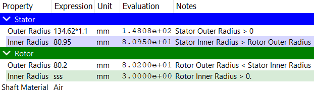

# 寸法チェックポイント
<p></p>

ステータおよびロータコアの寸法はここで定義されます。
* ステータ外径(Stator Outer Radius)
* ステータ内径(Stator Inner Radius)
* ロータ外径(Rotor Outer Radius)
* ロータ内径(Rotor Inner Radius)

制約は機械のトポロジーによって異なります。内部ローターマシンの場合：
```
ステータ外径 > ステータ内径 > ロータ外径 > ロータ内径
```
外部ローターマシンの場合：
```
ステータ外径 < ステータ内径 < ロータ外径 < ロータ内径
```

上記の制約が満たされない場合、ソフトウェアはログパネルにエラーメッセージを表示し、機械のチェックポイントが無効としてマークされます。制約が満たされるまで、ジオメトリは生成されません。