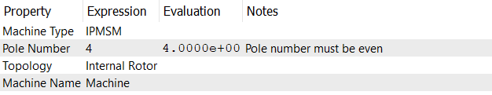

# タイプチェックポイント

## 機械タイプ (Machine Type)
現在、このソフトウェアは以下の3種類の機械をサポートしています：
* **IPMSM**: 埋込型永久磁石同期モーター
* **SPMSM**: 表面型永久磁石同期モーター
* **SynRM**: 同期リラクタンスモーター

## 極数 (Pole Number)
極数は機械内の磁極の数を指します。
:::info
極数は正の偶数である必要があります。
:::

## トポロジー (Topology)
機械のトポロジーは、**内部ローター(Internal Rotor)**または**外部ローター(External Rotor)**のいずれかです。

## 機械名 (Machine Name)
機械名は、ユーザーが定義する文字列で、機械を識別します。英数字、スペース、特殊文字を含む任意の文字列を使用できます。この名前は、プロジェクトツリーや出力ファイル内で機械をラベル付けするために使用されます。