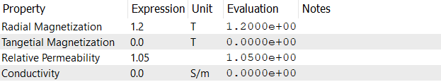

# 磁石チェックポイント
磁石は磁化の方向と磁束密度の大きさによって特徴付けられます。磁化の方向は磁力線の向きを示し、磁束密度の大きさはテスラ（T）またはガウス（G）で表されます（1 T = 10,000 G）。
磁石の比透磁率は、材料の透磁率を真空の透磁率で割った無次元の指標で、外部から磁場を加えたときに、どれだけ磁束密度が生じやすいかを示します（μᵣ = B / μ₀H）。
また、磁石の電気伝導率を考慮することで、オーミック損失の評価も可能です。

以下のプロパティが磁石に対して定義されています：
- **径方向磁化(Radial Magnetization)**：円筒形磁石では径方向、矩形磁石では法線方向の磁化強度を指定します。単位はテスラ（T）またはガウス（G）のどちらかで入力します。  
- **周方向磁化(Tangential Magnetization)**：周方向（接線方向）の磁化強度を指定します。単位はテスラ（T）またはガウス（G）のどちらかで入力します。
- **比透磁率(Relative Permeability)**：磁石材料の比透磁率を指定します。無次元量です。  
- **導電率(Conductivity)**：磁石材料の導電率を指定します。シーメンス毎メートル（S/m）で測定し、デフォルトは 0 S/m です。

