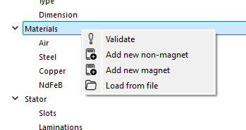
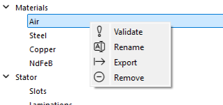
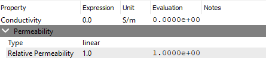
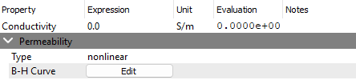
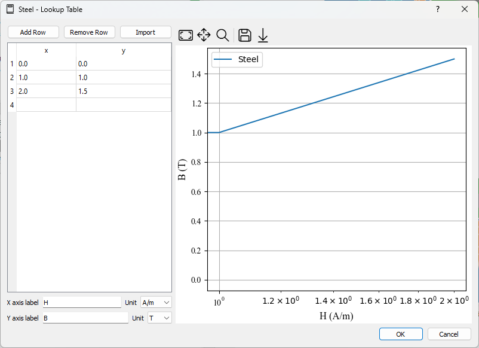
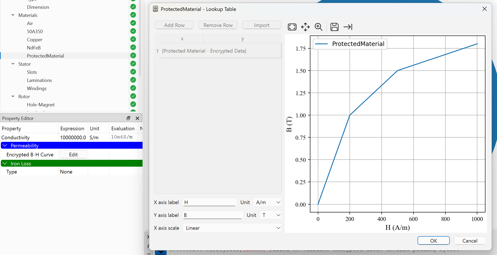
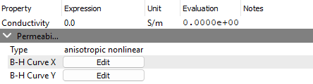
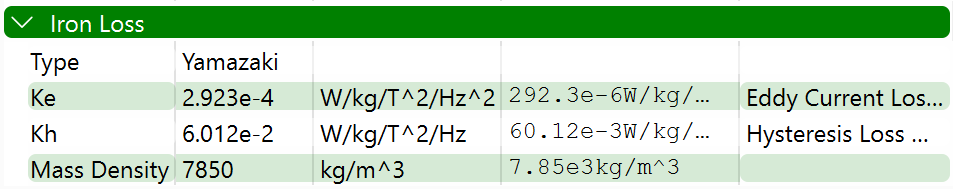
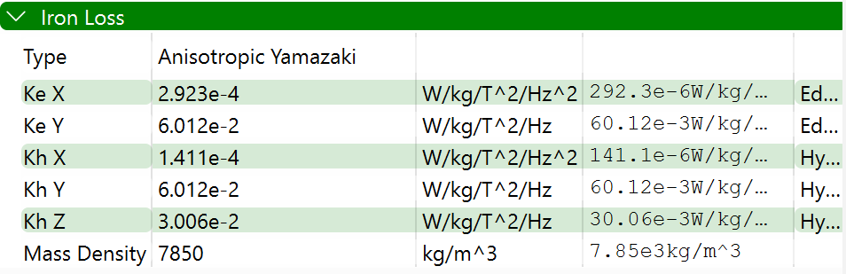

# 非磁石材料チェックポイント
`Non-magnet` 材料は巻線の導電性材料、ステータおよびロータのコア材料、空気、真空などの磁石以外の材料を指します。

新しい`Non-magnet`材料を追加するには、`Materials` マイルストーンを右クリックし、`Add new non-magnet` を選択します。これにより、デフォルトのプロパティを持つ新しい非磁石材料が作成されます。その後、`Properties` パネルから必要に応じて材料のプロパティを変更できます。
<p align="center"></p>

各材料は、`Materials` マイルストーンで材料を右クリックすることで、`Validate`（検証）、`Rename`（名前変更）、`Export`（抽出）、および`Remove`（削除）が可能です。`Validate` （判定）オプションは、材料のプロパティが有効かどうかを判定し、エラーがある場合はメッセージを表示します。`Rename` （名前変更）オプションを使用すると、名前が設定されていなかった場合に材料の名前を変更できます。`Export`（抽出） オプションは、材料のプロパティを JSON 形式でエクスポートします。これは、材料を別のプロジェクトにインポートするために使用できます。`Remove` （削除）オプションは、プロジェクトから材料を削除します。
<p align="center"></p>

## 透磁率タイプ (Permeability Types)
`Non-magnet`材料には3つのタイプがあります：
- **線形 (Linear)**: これは非磁石材料のデフォルトタイプです。一定の透磁率と導電率を持ちます。
- **非線形 (Nonlinear)**: このタイプの非磁石材料は、非線形の透磁率を持ちますが、導電率は一定です。
- **異方性非線形 (Anisotropic Nonlinear)**: 導電率は一定で、方向によって透磁率が異なります。

### 線形タイプ (Linear Type)
線形タイプの非磁石材料は、一定の透磁率と導電率を持ちます。材料のプロパティは、次のパラメータによって定義されます：
- **導電率 (Conductivity)**: 材料の一定の導電率。単位は `S/m`、`S/cm`、`S/mm`、`S/um`、および `S/nm` です。デフォルト値は `0 S/m` です。
- **比透磁率 (Relative Permeability)**: 材料の一定の比透磁率。無次元量であるため、単位はありません。デフォルト値は `1` です。

<p align="center"></p>

線形タイプの非磁石材料の JSON 形式は次のとおりです：
```json
{
    "type": "non_magnet",
    "name": "Air",
    "_conductivity_expression": "0.0",
    "_conductivity_unit": "S/m",
    "permeability_type": "linear",
    "permeability": {
        "_relative_permeability_expression": "1.0"
    },
    "iron_loss": null
}
```

### 非線形タイプ (Nonlinear Type)
非線形非磁石材料は、導電率は一定で、非線形の透磁率を持つ材料に適しています。材料のプロパティは、次のパラメータによって定義されます：
- **導電率 (Conductivity)**: 材料の導電率（定数）。単位は `S/m`、`S/cm`、`S/mm`、`S/um`、および `S/nm` です。デフォルト値は `0 S/m` です。
- **B-H カーブ (B-H Curve)**: 材料の B-H カーブ。B-H カーブは、磁場強度 (H) と磁束密度 (B) の関係を表す非線形関数です。B-H カーブは、`H` と `B` のルックアップテーブルによって定義できます。単位はそれぞれ `A/m` と `T` です。
<p align="center"></p>
B-H カーブを編集するには、`B-H Curve` セクションの `Edit` ボタンをクリックします。これにより、B-H カーブの点を追加、編集、削除できる新しいウィンドウが開きます。B-H カーブデータを CSV 形式でインポートおよびエクスポートすることもできます。
<p align="center"></p>

JSON 形式は次のとおりです：
```json
{
    "type": "non_magnet",
    "name": "Steel",
    "_conductivity_expression": "0.0",
    "_conductivity_unit": "S/m",
    "permeability_type": "nonlinear",
    "permeability": {
        "b_unit": "T",
        "h_unit": "A/m",
        "data": [
            [
                0.0,
                0.0
            ],
            [
                1.0,
                1.0
            ],
            [
                2.0,
                1.5
            ]
        ]
    },
    "iron_loss": null
}
```

### 保護された非線形タイプ (Protected Nonlinear Types)
非線形および異方性非線形の非磁石材料の B-H カーブデータは、不正なアクセスや改ざんを防ぐために保護できます。データは暗号化されていますが、材料はシミュレーションで問題なく使用できます。

<p align="center"></p>

保護された非線形非磁石材料の JSON 形式は次のとおりです：
```json
{
    "type": "non_magnet",
    "name": "ProtectedMaterial",
    "_conductivity_expression": "1e6",
    "_conductivity_unit": "S/m",
    "permeability_type": "encrypted nonlinear",
    "permeability": {
        "_b_unit": "T",
        "_h_unit": "A/m",
        "_encrypted_data": "JsOlfnjLEIaLhEao7zsh+ifwryc4joLXBlqaQjo2XHQrbUSx2qUYAot16WP11hU13CgRNm0QgReZNZpJ/9JOeg9WdP6Ot7CPU/f0rGHuWgaz1KBfoT9wI8pKN7ZsZiZB"
    },
    "iron_loss": null
}
```

### 異方性非線形タイプ (Anisotropic Nonlinear Type)
異なる方向で非線形の透磁率を持つ材料は、異方性非線形材料と呼ばれます。材料のプロパティは、次のパラメータによって定義されます：
- **導電率 (Conductivity)**: 材料の一定の導電率。単位は `S/m`、`S/cm`、`S/mm`、`S/um`、および `S/nm` です。デフォルト値は `0 S/m` です。
- **B-H カーブ X (B-H Curve X)**: X 方向の材料の B-H カーブ。
- **B-H カーブ Y (B-H Curve Y)**: Y 方向の材料の B-H カーブ。
<p align="center"></p>
B-H カーブの変更は、非線形タイプと同様です。

JSON 形式は次のとおりです：
```json
{
    "type": "non_magnet",
    "name": "Steel",
    "_conductivity_expression": "0.0",
    "_conductivity_unit": "S/m",
    "permeability_type": "anisotropic nonlinear",
    "permeability": {
        "b_unit": "T",
        "h_unit": "A/m",
        "x_data": [
            [
                0.0,
                0.0
            ],
            [
                1.0,
                1.0
            ]
        ],
        "y_data": [
            [
                0.0,
                0.0
            ],
            [
                1.0,
                1.0
            ]
        ]
    },
    "iron_loss": null
}
```

## 鉄損失

非磁石材料に対して定義できる鉄損失には、以下の2種類があります：
- **山崎モデル (Yamazaki)**: この鉄損失タイプは山崎モデルに基づいています。山崎鉄損失の特性は、以下のパラメータで定義されます：
    - **Ke**: 渦電流損失係数。
    - **Kh**: ヒステリシス損失係数。
    - **質量密度 (Mass Density)**: 材料の質量密度。

<p align="center"></p>

JSON 形式は次のとおりです：
```json
{
    "type": "non_magnet",
    "name": "Steel",
    "_conductivity_expression": "0.0",
    "_conductivity_unit": "S/m",
    "permeability_type": "nonlinear",
    "permeability": {
        "b_unit": "T",
        "h_unit": "A/m",
        "data": [
            [
                0.0,
                0.0
            ],
            [
                1.0,
                1.0
            ],
            [
                2.0,
                1.5
            ]
        ]
    },
    "iron_loss": {
        "type": "yamazaki",
        "_ke_expression": "2.923e-4",
        "_ke_unit": "W/kg/T^2/Hz^2",
        "_kh_expression": "6.012e-2",
        "_kh_unit": "W/kg/T^2/Hz",
        "_mass_density_expression": "7850",
        "_mass_density_unit": "kg/m^3"
    }
}
```

- **異方性山崎モデル (Anisotropic Yamazaki)**: この鉄損失タイプは異方性山崎モデルに基づいています。異方性山崎鉄損失の特性は、以下のパラメータで定義されます：
    - **Ke X**: X方向の渦電流損失係数。
    - **Kh X**: X方向のヒステリシス損失係数。
    - **Ke Y**: Y方向の渦電流損失係数。
    - **Kh Y**: Y方向のヒステリシス損失係数。
    - **Kh Z**: Z方向のヒステリシス損失係数。
    - **質量密度 (Mass Density)**: 材料の質量密度。

<p align="center"></p>

JSON 形式は次のとおりです：
```json
{
    "type": "non_magnet",
    "name": "Steel",
    "_conductivity_expression": "0.0",
    "_conductivity_unit": "S/m",
    "permeability_type": "nonlinear",
    "permeability": {
        "b_unit": "T",
        "h_unit": "A/m",
        "data": [
            [
                0.0,
                0.0
            ],
            [
                1.0,
                1.0
            ],
            [
                2.0,
                1.5
            ]
        ]
    },
    "iron_loss": {
        "type": "anisotropic_yamazaki",
        "_ke_x_expression": "2.923e-4",
        "_ke_x_unit": "W/kg/T^2/Hz^2",
        "_ke_y_expression": "6.012e-2",
        "_ke_y_unit": "W/kg/T^2/Hz",
        "_kh_x_expression": "1.411e-4",
        "_kh_x_unit": "W/kg/T^2/Hz^2",
        "_kh_y_expression": "6.012e-2",
        "_kh_y_unit": "W/kg/T^2/Hz",
        "_kh_z_expression": "3.006e-2",
        "_kh_z_unit": "W/kg/T^2/Hz",
        "_mass_density_expression": "7850",
        "_mass_density_unit": "kg/m^3"
    }
}
```