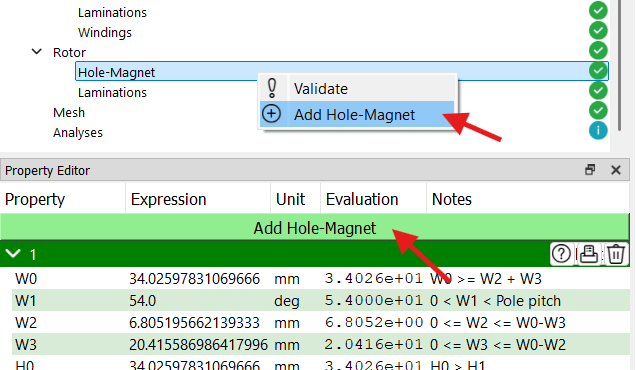
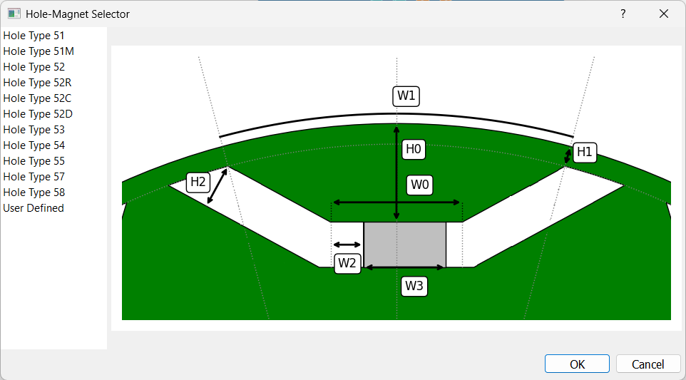

# IPMSM Hole-Magnet

このタイプのチェックポイントは、モータの種類が **IPMSM（埋込磁石型同期モーター）** の場合にロータマイルストーンに表示されます。このタイプのモータでは、複数の埋め込み磁石（あるいは空隙）を持つことが可能です。各埋め込み磁石は、独自の幾何学的および材料特性を有しています。

新しい埋め込み磁石を追加するには、プロパティエディターパネル内の **「Add Hole-Magnet」** ボタンをクリックするか、プロジェクトツリー内の **「Hole-Magnet」** チェックポイントを右クリックして、メニューから **「Add Hole-Magnet」** を選択します。

ソフトウェアには、一般的に使用される埋め込み磁石があらかじめ用意されています。ユーザーは独自の埋め込み磁石を作成することも可能です。以下の図は、使用可能な埋め込み磁石の一覧を示しています。

各埋め込み磁石の幾何学的および材料特性は、プロパティエディターパネル内の各セクションで定義されます。各セクションには以下のボタンが含まれています：

- &#xE9CE; 形状のプレビューを表示するボタン
- &#xEC5B; ヒント値をログパネルに出力するボタン
- &#xE74D; 該当する埋め込み磁石を削除するボタン
