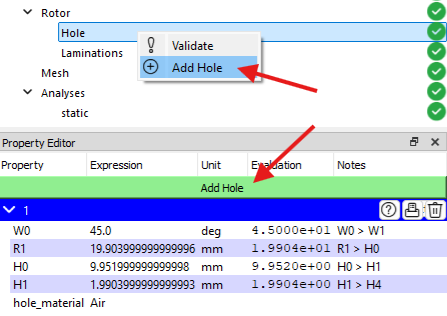
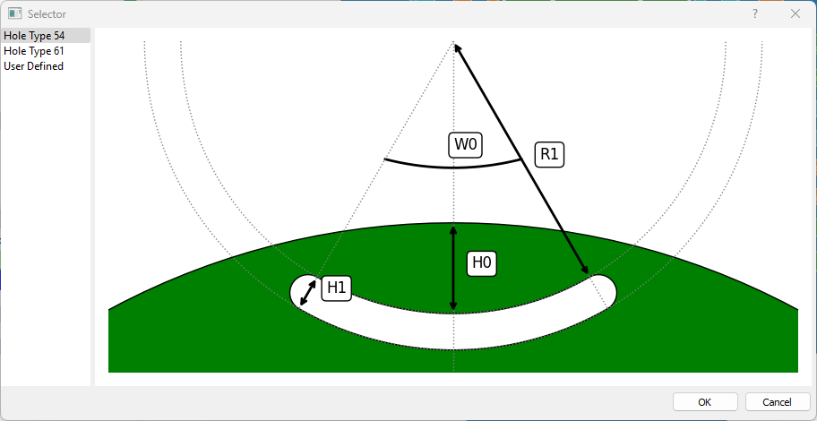

# Hole Checkpoint
# 穴（Hole）チェックポイント

このチェックポイントは、機械の種類が **SynRM（同期リアクタンスモーター）** の場合にローターマイルストーンに表示されます。このタイプのモーターでは、複数の穴セットを持つことが可能です。各穴は、それぞれ独立した幾何学的および材料特性を有しています。

新しい穴を追加するには、プロパティエディターパネル内の **「穴を追加」** ボタンをクリックするか、プロジェクトツリー内の **「Hole」** チェックポイントを右クリックして、コンテキストメニューから **「穴を追加」** を選択します。

ソフトウェアには、一般的に使用される穴の形状があらかじめ用意されています。また、**「ユーザー定義」** オプションを選択することで、カスタムの穴ペアを作成することも可能です。以下の図は、使用可能な穴-磁石ペアの一覧を示しています。

各穴-磁石ペアの幾何学的および材料特性は、プロパティエディターパネル内のそれぞれのセクションに表示されます。各セクションには以下の機能ボタンがあります：

- &#xE9CE;：穴の形状をプレビュー表示
- &#xEC5B;：ヒント値をログパネルに出力
- &#xE74D;：該当する穴の形状を削除
