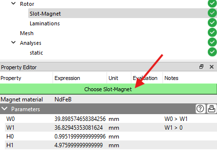
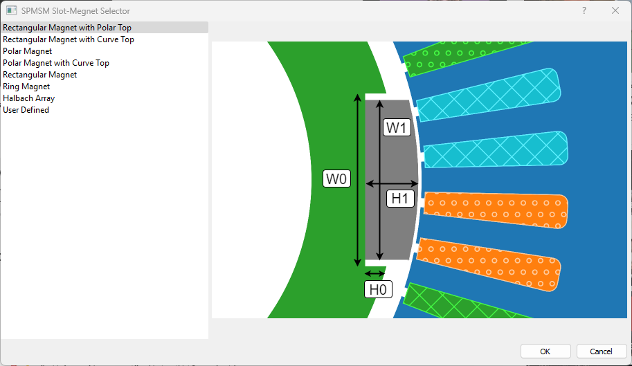

# 表面磁石チェックポイント

機械の種類が **SPMSM（表面埋込型同期モータ）** の場合、このチェックポイントがロータマイルストーンに表示されます。SPMSMは単一の表面磁石を持ちます。

表面磁石を選択するには、プロパティエディターパネル内の **「Choose Slot-Magnet」** ボタンをクリックします。ダイアログボックスが表示され、使用可能な表面磁石の一覧が提示されます。ユーザーは一覧から一つを選ぶか、**「User Defined」** オプションを使って独自の表面磁石を作成することも可能です。

表面磁石の幾何学的および材料特性は、それぞれのセクションでプロパティエディターパネル内に表示されます。SPMSMは単一の表面磁石を持つため，ローター内のすべての磁石に適用されることになります。

- &#xE9CE;：表面磁石の形状をプレビュー表示
- &#xEC5B;：ヒント値をログパネルに出力
