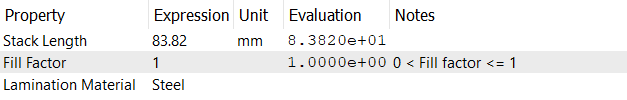

# ラミネーション
このチェックポイントでは、ステータコアのパラメータを指定します。以下のプロパティが定義されています：
- **積層長 (Stack Length)**: ステータコアの長さを指定します。
- **充填率 (Fill Factor)**: ステータコアの充填率を指定します。充填率は、積層材が占める面積とステータコア全体の長さの比率を表します。これは0から1の次元のない量です。
- **ラミネーション材料 (Lamination Material)**: ステータコアの材料を指定します。材料は利用可能な材料リストから選択されます。この利用可能な材料リストは、`Material`チェックポイントで定義されています。

