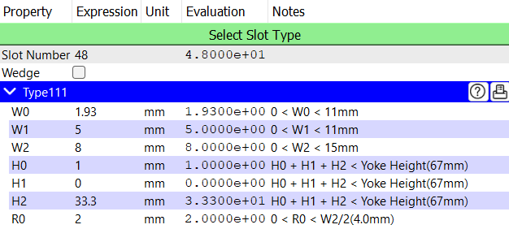
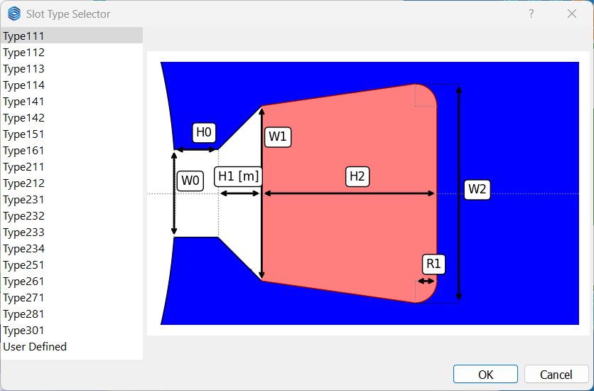
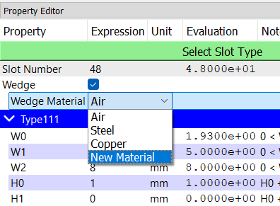
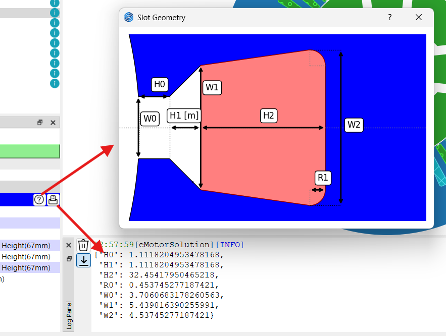

# スロットチェックポイント

このチェックポイントでは、スロットの数、スロットタイプ、選択されたスロットタイプのパラメータ、およびウェッジの特性を定義します。以下の図は、スロットタイプ111のスロット特性を示しています。

## スロットタイプ (Slot Type)
**スロットタイプを選択(Select Slot Type)**ボタンをクリックすると、ポップアップウィンドウに表示される利用可能なスロットタイプのリストから希望のスロットタイプを選択できます。  
現在、19種類のよく使用されるスロット形状が利用可能です。各スロットタイプのパラメータ数は異なります。  
:::warning
スロットタイプ161は外部ローターマシン専用です。
:::

## ウェッジ(Wedge)
デフォルトでは、ウェッジのチェックボックスはオフになっており、スロットにウェッジが含まれず、空気で満たされています。  
ウェッジのチェックボックスをオンにすると、`Wedge material`プルダウンメニューがWedgeのチェックボックスの下に表示されます。このプルダウンメニューには、選択可能な非磁性材料のリストが含まれています。

## スロット特性 (Slot Properties)
選択されたスロットタイプに応じて、スロット特性は異なります。スロット形状をプレビューするには、プロパティエディターパネル内の &#xE9CE; ボタンをクリックします。これにより、スロット形状を確認できるポップアップウィンドウが開きます。  

選択されたスロットタイプのヒントを表示するためには、プロパティエディターパネル内の &#xEC5B; ボタンをクリックします。これにより、ヒント値がログパネルに表示されます。ヒント値は選択されたスロットタイプのデフォルト値であり、スロット特性を定義する際のヒントになります。

