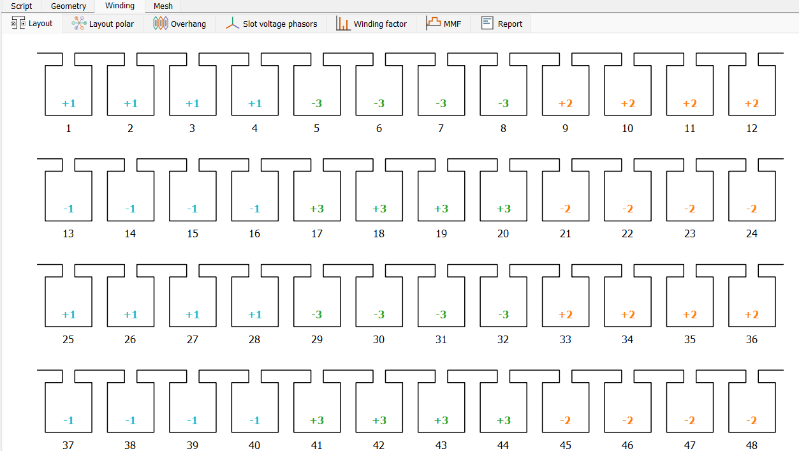

# 巻線チェックポイント
巻線構成には以下のプロパティがあります：

- **巻線材料 (Winding Material)**: 巻線材料は、利用可能な材料リストから選択されます。このリストには、`Materials`チェックポイントで定義されたすべての材料が含まれています。
- **相数 (Phase Number)**: モータの相数を指定します。デフォルト値は3です。
- **レイヤー構成 (Layer Configuration)**: 以下の3種類の層構成が利用可能です：
    - `Single`: スロットに1層の巻線が配置されます。
    - `Distributed`: 各スロットに2層の巻線が含まれます。第1層はスロット内に配置され、第2層は第1層の上に配置されます。第2層はコイル幅に従ってシフトされます。
    - `Concentrated`: 各スロットに2層の巻線が隣接して配置され、集中巻線を形成します。
- **ターン数 (Turns Per Coil)**: 各コイルのターン数を指定します。
- **並列数 (Parallel Paths)**: 巻線内の並列数を指定します。デフォルト値は1です。
- **コイル幅 (Coil Span)**: `Distributed`構成の場合にのみ有効です。`Concentrated`構成の場合、コイル幅は1である必要があります。また、`Single`構成の場合、コイル幅はコイルピッチと等しくなければなりません。

巻線タブで巻線構成図を確認できます。

