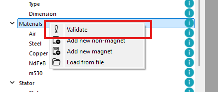
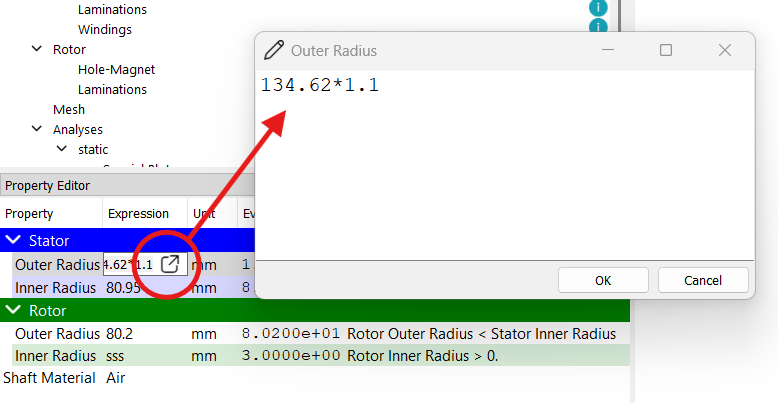
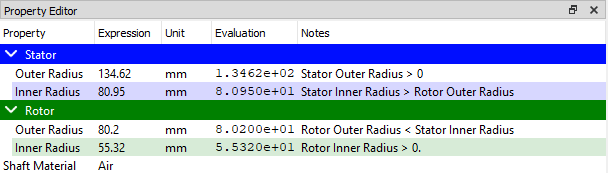

# メインウィンドウ

ソフトウェアのメインウィンドウは、主に3つのパネルに分かれています：
* **プロジェクトパネル**：プロジェクトツリーを表示し、プロジェクトの管理を行います  
* **プロパティパネル**：プロジェクトツリーで選択された項目のプロパティを表形式で表示します  
* **ログパネル**：ログメッセージやエラーを表示します  

メインウィンドウには、共通機能へのクイックアクセスのためのメニューバーとツールバーも含まれています。

## プロジェクトパネル (Projects Panel)

プロジェクトツリーは、プロジェクトの構成や進行状況を階層的に表現したものです。
各セクションはプロジェクトのフェーズを表し、その中の各項目は具体的なマイルストーンやチェックポイントに対応しています。
セクションは展開・折りたたみが可能で、ユーザーは目的の項目に素早くアクセスし、プロパティパネルでその詳細を確認できます。

ツリーはプロジェクトの進行段階を反映する形で構成されています。各セクションは異なるマイルストーンまたはチェックポイントを表し、クリックするとプロパティパネルにその詳細が表示されます。

* **`Script`チェックポイント**：パラメータ定義とPythonスクリプト環境を提供  
* **`Machine`マイルストーン**：モータの種類と主要寸法を設定  
* **`Materials`マイルストーン**：材料の定義を管理  
* **`Stator`マイルストーン**：ステータスロット形状と巻線構成  
* **`Rotor`マイルストーン**：ロータのスロット・マグネット構成  
* **`Mesh`チェックポイント**：メッシュ仕様の設定  
* **`Analyses`マイルストーン**：各種解析の定義および実行  

各マイルストーンやチェックポイントには、左側にアイコンで示される状態が割り当てられます。状態は以下の通りです：

| 状態     | アイコン | 説明                                       |
|----------|----------|--------------------------------------------|
| 初期     |  | 未検証の状態             |
| 有効     |      | パラメータが妥当で、マイルストーンが検証済み     |
| 警告     |  | サブチェックポイントの一部パラメータが不適切     |
| 無効     |  | パラメータにエラーがある                         |

チェックポイントはユーザーが変更を行うたびに自動的に検証されますが、右クリックして「`Validate`（検証）」を選択することで手動検証も可能です。検証に失敗した場合は、`ログ`パネルにメッセージが表示されます。

## プロパティパネル (Property Editor Panel)

プロパティパネルは、プロジェクトツリーで選択された項目の詳細プロパティを表示します。表示は以下の5列の表形式です：*プロパティ*, *数式*, *単位*, *評価値*, *注記*

:::tip
*数式*列のセルをクリックすることで、プロパティの編集が可能です。入力スペースが小さい場合は、セル右側のボタンをクリックしてポップアップウィンドウを開き、広いエリアで編集できます。

:::

*数式*はPythonインタープリタで評価可能な数学的な表現で、`numpy`ライブラリ（エイリアス：`np`）も使用可能です。例：
* `2 * 3 + 4` → `10`
* `np.pi` → `3.141592653589793`
* `np.sqrt(4)` → `2.0`
* `np.sin(np.pi/2)` → `1.0`
* `parameter1 + parameter2` → `Script`チェックポイントで定義された2つのパラメータの和

:::info
`numpy`の詳細については、[numpyドキュメント](https://numpy.org/doc/stable/user/absolute_beginners.html)を参照してください。
:::

一部のプロパティには単位があり、*単位*列に表示されます。*評価値*列には、SI単位での評価結果が表示されます。

追加情報は*注記*列に表示されます。無効な式がある場合、その行は赤くハイライトされ、エラーメッセージが*ログ*パネルと*注記*に表示されます。

## ログパネル (Log Panel)

ログパネルは、ログメッセージやエラーを表示します。各メッセージには、タイムスタンプ、プロジェクト名、重要度、メッセージ内容が含まれます。

ログパネルをクリアするには、左上のゴミ箱アイコンをクリックするか、`Ctrl + K` ショートカットを使用します。

