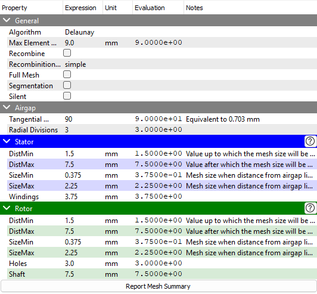
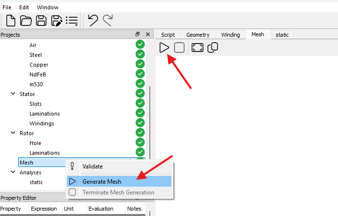
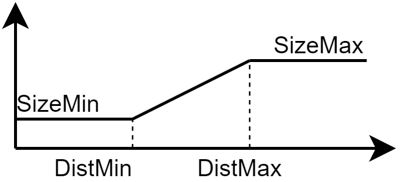

# メッシュチェックポイント

このチェックポイントでは、メッシュの各種プロパティが定義されます。以下のプロパティが利用可能です：

メッシュを生成するには、プロジェクトツリー内の **「Mesh」** チェックポイントを右クリックして **「Generate Mesh」** を選択するか、メッシュタブ内の &#xE768; ボタンをクリックします。ジオメトリが検証済みであれば、メッシュが生成されます。メッシュ生成には数分程度の時間を要する場合があります。これはジオメトリの複雑さ、アルゴリズムにも依存します。

### アルゴリズム（Algorithm）

メッシュ生成に使用されるアルゴリズム。選択可能なアルゴリズムは以下の通りです：

1. MeshAdapt  
2. Automatic  
3. Initial mesh only  
4. Delaunay  
5. Frontal-Delaunay  
6. BAMG  
7. Frontal-Delaunay for Quads  
8. Packing of Parallelograms  
9. Quasi-structured Quad  

### 最大要素サイズ（Max Element Size）

メッシュ内の要素の最大サイズを設定します。

### 再構成 / 再構成アルゴリズム（Recombine / Recombination Algorithm）

**Recombine** チェックボックスをオンにすると、メッシュが再構成されて四辺形要素になります。

利用可能な再構成アルゴリズム：

1. simple  
2. blossom  
3. simple full-quad  
4. blossom full-quad  

### 全領域メッシュ（Full Mesh）

**Full Mesh** チェックボックスをオンにすると、全ジオメトリに対してメッシュが生成されます。

### セグメンテーション（Segmentation）

**Segmentation** チェックボックスをオンにすると、メッシュに対してセグメンテーションラインが生成されます。

### サイレント（Silent）

**Silent** チェックボックスをオンにすると、メッシュ生成中にログパネルへメッセージが表示されません。

### エアギャップ（Airgap）

- **周方向分割数（Tangential Divisions）**：エアギャップ線の周方向（接線方向）におけるメッシュ分割数  
- **径方向分割数（Radial Divisions）**：エアギャップ領域の径方向におけるメッシュ分割数

### ステータ（Stator）

ステータ領域のメッシュサイズは、エアギャップ線からの距離に応じて次のように定義されます：

- **DistMin**：メッシュサイズが `SizeMin` となるまでの距離  
- **DistMax**：`SizeMax` に切り替わる距離  
- **SizeMin**：距離が `DistMin` より小さい場合のメッシュサイズ  
- **SizeMax**：距離が `DistMax` より大きい場合のメッシュサイズ  
- **Windings**：巻線領域のメッシュサイズ  

### ロータ（Rotor）

ステータと同様に、ロータ領域も次のパラメータで定義されます：

- **DistMin**：`SizeMin` となる距離  
- **DistMax**：`SizeMax` に切り替わる距離  
- **SizeMin**：`DistMin` より内側のメッシュサイズ  
- **SizeMax**：`DistMax` より外側のメッシュサイズ  
- **Holes**：空隙領域のメッシュサイズ（IPMSM および SynRM のみ）  
- **Magnets**：磁石領域のメッシュサイズ（IPMSM および SPMSM のみ）

### メッシュ概要レポート（Report Mesh Summary）

このボタンを押すと、メッシュ概要がログパネルに出力されます。
