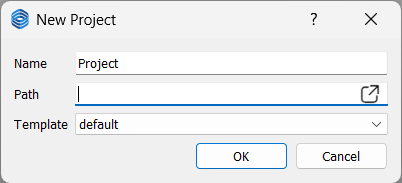

# プロジェクト管理

eMotorSolution では、システムの複雑さと多数の構成要素に対応するため、単一のモノリシックなファイルではなく、複数のファイルとフォルダでプロジェクトを構成します。これにより、プロジェクトの整理と管理が容易になります。

以下は、2 つの解析を含むプロジェクト構造の例です：

```bash
project_root
├── project_name.json
├── Scripts
|   ├── ems.pyi
│   └── main.py
│── Mesh
|   ├── rotor.geo
|   ├── rotor.m
|   ├── rotor.neu
|   ├── stator.geo
|   ├── stator.m
|   └── stator.neu
│── analysis1
|   └── analysis1.json
└── analysis2
    └── analysis2.json
````

* `project_name.json`：
  プロジェクトの主要ファイルで、モータタイプ、寸法、材料、その他多くのパラメータに関する情報が含まれています。JSON 形式で記述されており、プロジェクトのエントリーポイントとなります。JSON は、人間が読み書きしやすく、プログラムによる解析・生成も容易な軽量データ交換フォーマットです。

* `Scripts`：
  プロジェクト内で使用されるすべての Python スクリプトが格納されるフォルダです。`ems.pyi` は eMotorSolution ライブラリ `ems` の型ヒントを含むスタブファイルです。`main.py` はスクリプト実行のエントリーポイントとなるファイルです。このフォルダの詳細は [スクリプトのチェックポイント](./script) を参照してください。

* `Mesh`：
  メッシュファイルを格納するフォルダで、[メッシュのチェックポイント](./mesh) で生成されたファイルが含まれます。ステータおよびロータのメッシュファイルは、`.geo`、`.m`、`.neu` の 3 種類の形式で保存されます。

  * `.geo` ファイルは、GMSH 形式でメッシュの形状情報を記述するジオメトリファイルです。
  * `.neu` ファイルは、`.geo` ファイルから生成された NEU 形式のメッシュファイルです。
  * `.m` ファイルは内部使用専用であり、ユーザーが編集することは想定されていません。

* `analysis` フォルダ：
  各プロジェクトは複数の解析を持つことができ、それぞれの解析は個別のフォルダに保存されます。各解析フォルダは自己完結型であり、`EMSolution` ライブラリ `pyemsol` により他の解析とは独立して実行できます。
  各フォルダには、解析タイプ、境界条件、初期条件、ソルバー設定など解析に必要なすべての情報を含む JSON 形式の `input_control` ファイルが含まれます。解析実行後、`Mesh` フォルダに存在するステータおよびロータの `.neu` ファイルは、解析フォルダにコピーされます（既に存在する場合はコピーされません）。ポストプロセス用のファイルもこのフォルダ内に保存されます。

## AppData

アプリケーションの設定、新規プロジェクトのテンプレート、一時ファイルなどは `AppData` フォルダに保存されます。このフォルダの場所は、使用している OS によって異なります：

* **Windows**：
  `C:\Users\<ユーザー名>\AppData\Local\eMotorSolution`
  （このフォルダはデフォルトで非表示になっているため、エクスプローラーで隠しファイルの表示を有効にする必要があります。）
  または、Windows エクスプローラーや「ファイル名を指定して実行」（Win + R）で `%localappdata%\eMotorSolution` と入力して直接開くこともできます。

* **Linux**：
  `/home/<ユーザー名>/.eMotorSolution`

## 新規作成

**File** メニューの
<span style={{ fontFamily: 'Segoe Fluent Icons', fontSize: '1.0em' }}>&#xE8A5;</span>**New** ボタンをクリックすると、新しいプロジェクトを作成できます。

ダイアログが表示され、プロジェクト名、保存先パス、使用するテンプレートを指定できます。プロジェクト名と保存先パスは必須、テンプレートは任意です。テンプレートを指定しない場合、デフォルトテンプレートが使用されます。指定されたパスにプロジェクト名のフォルダが作成され、その中に `project_name.json` ファイル、および `Scripts`、`Mesh` フォルダが作成されます。

デフォルトテンプレートは `AppData` フォルダ内の `default.json` です。

<p class="ems"></p>

## 開く

**File** メニューの
<span style={{ fontFamily: 'Segoe Fluent Icons', fontSize: '1.0em' }}>&#xE838;</span>**Open** ボタンをクリックすると、既存のプロジェクトを開くことができます。
表示されるダイアログでプロジェクトの JSON ファイルを選択してください。

## 保存

**File** メニューの
<span style={{ fontFamily: 'Segoe Fluent Icons', fontSize: '1.0em' }}>&#xE7C3;</span>**Save** ボタンをクリックすると、現在のプロジェクトが保存されます。

## エクスポート

**File** メニューの  
<span style={{ fontFamily: 'Segoe Fluent Icons', fontSize: '1.0em' }}>&#xE792;</span>**Export** ボタンをクリックすると、現在のプロジェクトをシミュレーション結果なしで ZIP ファイルとして保存できます。  

この機能は、プロジェクトを他のユーザーと共有したい場合や、最小限のストレージ容量でプロジェクトをアーカイブしたい場合に便利です。  

作成される ZIP ファイルには、プロジェクトフォルダ全体が含まれます（`project_name.json` ファイル、`Scripts` フォルダ、`Mesh` フォルダ、および解析用の各フォルダ）。ただし、シミュレーション結果や一時ファイルは含まれません。


## テンプレートとして保存

現在のプロジェクトを新規プロジェクト用のテンプレートとして保存するには、**File** メニューの **Save as Template** ボタンをクリックします。
表示されるダイアログでテンプレート名を指定してください（テンプレート名は必須かつ一意である必要があります）。テンプレートは `AppData` フォルダ内に保存され、**New** ダイアログから利用可能になります。


