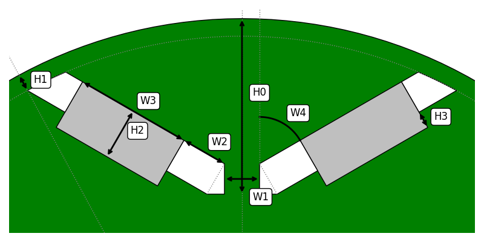

# Type 53

The `IPM_HoleMagnet53Data` is accessed through the `eMotorSolution.CheckPoints.Rotor.IPMSM.IPM_HoleMagnet53` module.

:::tip[Parameters]
- **W1_expression**: `str | float` The string mathematical expression or a float value for `W1`.
- **W1_unit**: `Literal["m", "dm", "cm", "mm", "in", "ft"]` The unit of the `W1`. Default is `"m"`.
- **W2_expression**: `str | float` The string mathematical expression or a float value for `W2`.
- **W2_unit**: `Literal["m", "dm", "cm", "mm", "in", "ft"]` The unit of the `W2`. Default is `"m"`.
- **W3_expression**: `str | float` The string mathematical expression or a float value for `W3`.
- **W3_unit**: `Literal["m", "dm", "cm", "mm", "in", "ft"]` The unit of the `W3`. Default is `"m"`.
- **W4_expression**: `str | float` The string mathematical expression or a float value for `W4`.
- **W4_unit**: `Literal["deg", "rad"]` The unit of the `W4`. Default is `"deg"`.
- **H0_expression**: `str | float` The string mathematical expression or a float value for `H0`.
- **H0_unit**: `Literal["m", "dm", "cm", "mm", "in", "ft"]` The unit of the `H0`. Default is `"m"`.
- **H1_expression**: `str | float` The string mathematical expression or a float value for `H1`.
- **H1_unit**: `Literal["m", "dm", "cm", "mm", "in", "ft"]` The unit of the `H1`. Default is `"m"`.
- **H2_expression**: `str | float` The string mathematical expression or a float value for `H2`.
- **H2_unit**: `Literal["m", "dm", "cm", "mm", "in", "ft"]` The unit of the `H2`. Default is `"m"`.
- **H3_expression**: `str | float` The string mathematical expression or a float value for `H3`.
- **H3_unit**: `Literal["m", "dm", "cm", "mm", "in", "ft"]` The unit of the `H3`. Default is `"m"`.
- **hole_material_init**: `str` The name of the hole material. It should be one of the non-magnet materials in the project's materials collection. Default is `Air`.
- **magnet_material_init**: `str` The name of the magnet material. It should be one of the magnet materials in the project's materials collection. Default is `NdFeB`.
:::

## Methods
| Method | Description |
|--------|-------------|
| set_W1(expression, unit) | Sets the `expression: str \| float` and `unit: Literal["m", "dm", "cm", "mm", "in", "ft"]` for `W1`. |
| set_W2(expression, unit) | Sets the `expression: str \| float` and `unit: Literal["m", "dm", "cm", "mm", "in", "ft"]` for `W2`. |
| set_W3(expression, unit) | Sets the `expression: str \| float` and `unit: Literal["m", "dm", "cm", "mm", "in", "ft"]` for `W3`. |
| set_W4(expression, unit) | Sets the `expression: str \| float` and `unit: Literal["deg", "rad"]` for `W4`. |
| set_H0(expression, unit) | Sets the `expression: str \| float` and `unit: Literal["m", "dm", "cm", "mm", "in", "ft"]` for `H0`. |
| set_H1(expression, unit) | Sets the `expression: str \| float` and `unit: Literal["m", "dm", "cm", "mm", "in", "ft"]` for `H1`. |
| set_H2(expression, unit) | Sets the `expression: str \| float` and `unit: Literal["m", "dm", "cm", "mm", "in", "ft"]` for `H2`. |
| set_H3(expression, unit) | Sets the `expression: str \| float` and `unit: Literal["m", "dm", "cm", "mm", "in", "ft"]` for `H3`. |
| set_hole_material(material_name) | Sets the `material_name: str` for `hole_material`. It should be one of the non-magnet materials in the project's materials collection. |
| set_magnet_material(material_name) | Sets the `material_name: str` for `magnet_material`. It should be one of the magnet materials in the project's materials collection. |
| validate() | Returns the validation status in dictionary format. |

## Attributes
| Attribute | Description |
|---|---|
| W1 | `float` Returns the evaluated value of `W1` in `m`. :warning: *read-only* |
| W2 | `float` Returns the evaluated value of `W2` in `m`. :warning: *read-only* |
| W3 | `float` Returns the evaluated value of `W3` in `m`. :warning: *read-only* |
| W4 | `float` Returns the evaluated value of `W4` in `deg`. :warning: *read-only* |
| H0 | `float` Returns the evaluated value of `H0` in `m`. :warning: *read-only* |
| H1 | `float` Returns the evaluated value of `H1` in `m`. :warning: *read-only* |
| H2 | `float` Returns the evaluated value of `H2` in `m`. :warning: *read-only* |
| H3 | `float` Returns the evaluated value of `H3` in `m`. :warning: *read-only* |
| hole_material | `str` Returns the name of the hole material. :warning: *read-only* |
| magnet_material | `str` Returns the name of the magnet material. :warning: *read-only* |
| hints | `dict[str, float]` Returns the hints for the slot in `m`. :warning: *read-only* |
