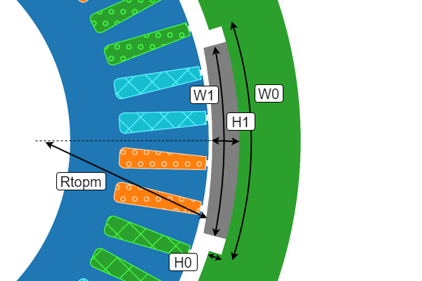
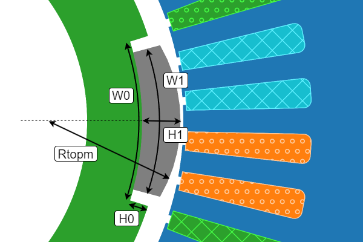

# Polar Magnet with Curve Top

The **Polar Magnet with Curve Top** data class, `SPM_SlotM14Data`, is accessed through the `eMotorSolution.CheckPoints.Rotor.SPMSM.SPM_SlotM14Data` module. 

:::tip[Parameters]
- **W0_expression**: `str | float` The string mathematical expression or a float value for `W0`.
- **W0_unit**: `Literal["deg", "rad"]` The unit of the `W0`. Default is `"deg"`.
- **W1_expression**: `str | float` The string mathematical expression or a float value for `W1`.
- **W1_unit**: `Literal["deg", "rad"]` The unit of the `W1`. Default is `"deg"`.
- **H0_expression**: `str | float` The string mathematical expression or a float value for `H0`.
- **H0_unit**: `Literal["m", "dm", "cm", "mm", "in", "ft"]` The unit of the `H0`. Default is `"m"`.
- **H1_expression**: `str | float` The string mathematical expression or a float value for `H1`.
- **H1_unit**: `Literal["m", "dm", "cm", "mm", "in", "ft"]` The unit of the `H1`. Default is `"m"`.
- **Rtopm_expression**: `str | float` The string mathematical expression or a float value for `Rtopm`.
- **Rtopm_unit**: `Literal["m", "dm", "cm", "mm", "in", "ft"]` The unit of the `Rtopm`. Default is `"m"`.
:::

## Methods
| Method | Description |
|--------|-------------|
| set_W0(expression, unit) | Sets the `expression: str \| float` and `unit: Literal["deg", "rad"]` for `W0`. |
| set_W1(expression, unit) | Sets the `expression: str \| float` and `unit: Literal["deg", "rad"]` for `W1`. |
| set_H0(expression, unit) | Sets the `expression: str \| float` and `unit: Literal["m", "dm", "cm", "mm", "in", "ft"]` for `H0`. |
| set_H1(expression, unit) | Sets the `expression: str \| float` and `unit: Literal["m", "dm", "cm", "mm", "in", "ft"]` for `H1`. |
| set_Rtopm(expression, unit) | Sets the `expression: str \| float` and `unit: Literal["m", "dm", "cm", "mm", "in", "ft"]` for `Rtopm`. |
| validate() | Returns the validation status in dictionary format. |

## Attributes
| Attribute | Description |
|---|---|
| W0 | `float` Returns the evaluated value of `W0` in `deg`. :warning: *read-only* |
| W1 | `float` Returns the evaluated value of `W1` in `deg`. :warning: *read-only* |
| H0 | `float` Returns the evaluated value of `H0` in `m`. :warning: *read-only* |
| H1 | `float` Returns the evaluated value of `H1` in `m`. :warning: *read-only* |
| Rtopm | `float` Returns the evaluated value of `Rtopm` in `m`. :warning: *read-only* |
| hints | `dict[str, float]` Returns the hints for the slot in `m`. :warning: *read-only* |
