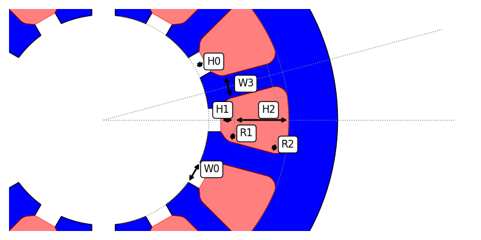

The `Slot151Data` is accessed through the `eMotorSolution.CheckPoints.Stator.slots.slot151` module.

:::tip[Parameters]
- **W0_expression**: `str | float` The string mathematical expression or a float value for `W0`.
- **W0_unit**: `Literal["m", "dm", "cm", "mm", "in", "ft"]` The unit of the `W0`. Default is `"m"`.
- **W3_expression**: `str | float` The string mathematical expression or a float value for `W3`.
- **W3_unit**: `Literal["m", "dm", "cm", "mm", "in", "ft"]` The unit of the `W3`. Default is `"m"`.
- **H0_expression**: `str | float` The string mathematical expression or a float value for `H0`.
- **H0_unit**: `Literal["m", "dm", "cm", "mm", "in", "ft"]` The unit of the `H0`. Default is `"m"`.
- **H1_expression**: `str | float` The string mathematical expression or a float value for `H1`.
- **H1_unit**: `Literal["m", "dm", "cm", "mm", "in", "ft"]` The unit of the `H1`. Default is `"m"`.
- **H2_expression**: `str | float` The string mathematical expression or a float value for `H2`.
- **H2_unit**: `Literal["m", "dm", "cm", "mm", "in", "ft"]` The unit of the `H2`. Default is `"m"`.
- **R1_expression**: `str | float` The string mathematical expression or a float value for `R1`.
- **R1_unit**: `Literal["m", "dm", "cm", "mm", "in", "ft"]` The unit of the `R1`. Default is `"m"`.
- **R2_expression**: `str | float` The string mathematical expression or a float value for `R2`.
- **R2_unit**: `Literal["m", "dm", "cm", "mm", "in", "ft"]` The unit of the `R2`. Default is `"m"`.
:::

## Methods
| Method | Description |
|--------|-------------|
| set_W0(expression, unit) | Sets the `expression: str \| float` and `unit: Literal["m", "dm", "cm", "mm", "in", "ft"]` for `W0`. |
| set_W3(expression, unit) | Sets the `expression: str \| float` and `unit: Literal["m", "dm", "cm", "mm", "in", "ft"]` for `W3`. |
| set_H0(expression, unit) | Sets the `expression: str \| float` and `unit: Literal["m", "dm", "cm", "mm", "in", "ft"]` for `H0`. |
| set_H1(expression, unit) | Sets the `expression: str \| float` and `unit: Literal["m", "dm", "cm", "mm", "in", "ft"]` for `H1`. |
| set_H2(expression, unit) | Sets the `expression: str \| float` and `unit: Literal["m", "dm", "cm", "mm", "in", "ft"]` for `H2`. |
| set_R1(expression, unit) | Sets the `expression: str \| float` and `unit: Literal["m", "dm", "cm", "mm", "in", "ft"]` for `R1`. |
| set_R2(expression, unit) | Sets the `expression: str \| float` and `unit: Literal["m", "dm", "cm", "mm", "in", "ft"]` for `R2`. |
| validate() | Returns the validation status in dictionary format. |

## Attributes
| Attribute | Description |
|---|---|
| W0 | `float` Returns the evaluated value of `W0` in `m`. :warning: *read-only* |
| W3 | `float` Returns the evaluated value of `W3` in `m`. :warning: *read-only* |
| H0 | `float` Returns the evaluated value of `H0` in `m`. :warning: *read-only* |
| H1 | `float` Returns the evaluated value of `H1` in `m`. :warning: *read-only* |
| H2 | `float` Returns the evaluated value of `H2` in `m`. :warning: *read-only* |
| R1 | `float` Returns the evaluated value of `R1` in `m`. :warning: *read-only* |
| R2 | `float` Returns the evaluated value of `R2` in `m`. :warning: *read-only* |
| winding_area | `float` Returns the area of the slot in `m^2`. :warning: *read-only* |
| wedge_area | `float` Returns the area of the wedge in `m^2`. :warning: *read-only* |
| total_area | `float` Returns the total area of the slot in `m^2`. :warning: *read-only* |
| hints | `dict[str, float]` Returns the hints for the slot in `m`. :warning: *read-only* |
