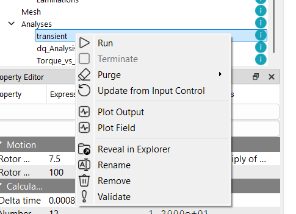

# 電流ートルク特性

## 解析の目的
永久磁石同期モータ（PMSM）の基本特性を評価するために電流位相角ートルク特性を算出します。これはd軸およびq軸のインダクタンス $L_d$, $L_q$ の算出を含みます。これにより、モータの基本性能特性を把握できます。
また，モータビヘイビアモデル用のデータを作成します。

:::info
DQ解析では，電流位相は -90度，0度，90度の3パターンで計算し，磁石磁束 $\psi_m$ とコイル鎖交磁束より $L_d$，$L_q$ を算出します。

$L_d = \frac{\psi_d - \psi_m}{I_d}$

$L_q = \frac{\psi_q}{I_q}$
ここで，$\psi_d$，$\psi_q$ はそれぞれd軸，q軸の鎖交磁束，$I_d$，$I_q$ はそれぞれd軸，q軸の電流です。
:::

:::info
モータビヘイビアモデルとは，電流に対するコイル鎖交磁束 $\psi$ とトルク $T$ をテーブルデータとして保持し，これらのデータを用いてモータの運転をシミュレートするモデルです。ビヘイビアモデルは，複雑な電磁解析を必要とせずに，モータの性能を迅速に評価できるため，システムレベルのシミュレーションや制御設計に広く利用されています。
:::

## Torque vs Current の作成
電流ートルク特性解析を追加するには、プロジェクトツリー内の `Analysis` マイルストーンを右クリックし、`Torque vs Current` を選択します。これにより、`Analysis` マイルストーンの下にユニークな名前を持つ電流ートルク特性解析ノードが作成されます。プロジェクトディレクトリ内には指定された名前の新しいフォルダが作成され、EMSolution 用の入力制御ファイル（JSON形式）が生成されます。

プロジェクトウィンドウにも新しいタブが追加され、解析名が表示されます。このタブには以下のサブセクションが含まれます：

* **Input Control**（入力制御）: このタブには JSON 形式の入力制御ファイルが表示されます。ユーザーはこのタブ内で直接ファイルを編集することができます。また、このタブには `Run`（実行）および `Terminate`（中止）ボタンがあり、EMSolution の実行や中止が可能です。

* **JSON View**（JSONビュー）: このビューでは解析フォルダ内のすべての JSON ファイルを読み取り専用で表示します。入力制御ファイル、メッシュファイル、その他関連ファイルを参照できます。

解析チェックポイントを右クリックし、表示されるコンテキストメニューからリネーム、削除、検証、フォルダの表示などの操作を行うことができます。

## 解析条件の設定

電流ートルク特性解析の設定には以下があります：

- `Rotor Position`（ロータ初期位置）はロータの初期位置を指定します。このとき，角度はd軸（ロータ磁石のN極の方向）とU相巻線のなす角であり、電気角となります。単位は`deg`です。
- `Rotor Speed`（回転速度）はロータの回転速度を指定します。単位は`rpm`です。
- `Delta Time`（時間ステップ）はトランジェント解析における時間ステップを指定します。単位は`sec`です。
- `Number of Steps`（ステップ数）はトランジェント解析における時間ステップの総数を指定します。
-  `CurrentRMS`（電流実効値）は各相に印加する電流の実効値を配列 `[0.0, 1.0, ...]` で指定します。単位は`Arms`です。
-  `Current Angle`（電流位相角）は印加する電流の位相角を配列 `[-90.0, 0.0, 90.0, ...]` で指定します。単位は`deg`です。
-  `Number of Multiprocess`（マルチプロセス数）は解析に使用するプロセス数(同時並列実行数) を指定します。デフォルトは1です。>1の場合，マルチプロセスで解析が実行され，計算時間の短縮が期待できます。並列実行は，`CurrentRMS`を対象に行われます。

`Rotor Speed`を設定し，`Print Sliding Mesh Properties`ボタンを押すことで，ロータの回転速度に基づいた時間ステップとステップ数の目安がそれぞれのパラメータに設定され，コンソールにも表示されます。
`Delta Time`の値は機械角一度/１ステップとして設定され，`Number of Steps`の値は電気角120度分のステップ数として設定されます。

:::info
モータ解析では、通常、回転数と極数に基づいて時間ステップとステップ数を設定します。例えば、回転数$N$`rpm`、極数$p$の場合、1電気周期の時間は$T=\frac{p}{2}\frac{N}{60}=\frac{pN}{120}$であり、これに基づいて `Delta Time` と `Number of Steps` を決定します。
:::

## 解析の実行

解析を実行するには、対応する解析タブ内の `Run` ボタンをクリックするか、プロジェクトツリー内の解析チェックポイントを右クリックして `Run` を選択します。解析が実行され、結果は対応するフォルダ内に保存されます。

計算状況は，ウィンドウ右下のプログレスバーに表示されます。
計算が終了すると，プログレスバーが完了を示し，コンソールに終了メッセージが表示されます。

:::warning
解析を実行する前に、eMotorSolution は対応するフォルダ内にメッシュファイルが存在するかを確認します。メッシュファイルが存在しない場合は、`Mesh` フォルダからコピーされます。存在する場合は、既存のメッシュファイルがそのまま使用されます。
メッシュファイルを変更した場合は、既存のメッシュファイルを削除することを推奨します。これにより、最新のメッシュファイルを用いた解析が確実に行われます。削除するには、プロジェクトツリー内の解析チェックポイントを右クリックし、`Purge > Purge All` を選択します。

また、`Purge > Purge Solutions` オプションを使用すると、メッシュファイルを削除せずに、すべての解ファイル（ソリューションファイル）のみを削除できます。これは、メッシュファイルを保持したまま古い解析結果を削除してディスク容量を確保したい場合に有効です。

:::

## 解析結果の確認

解析チェックポイントを右クリックし、`Plot Output` を選択することで、出力結果を表示できます。出力結果は `Plot` タブに表示されます。内蔵のプロットツールを使用して、結果の可視化が可能です。

`Plot Output` オプションでは、`Template`から選択することにより，$L_d$, $L_q$や電圧波形やトルク波形などの出力データを表示できます。これにより、モータの性能特性を評価できます。
以下が`Template`で選択可能なデータの例です：これらのデータは `JSON`ファイルで結果フォルダ内に保存されており，カッコ()内の数字は参照したファイル数を示します。

- `PMSM_LdLq (1)` はd軸およびq軸のインダクタンス $L_d$, $L_q$ を表示します。
- `PMSM_Torque_0deg (1)` は電流位相角0度の電流ートルク特性を表示します。
- `PMSM_Torque_Beta (1)` は各電流位相角における電流位相ートルク特性を表示します。
- `PMSM_EMBM (6)` は各電流位相角における三相およびd軸，q軸の電流，電圧，コイル鎖交磁束波形とトルク波形を表示します。

表示したいデータを選択すると，右側のグラフ領域に表示されます。 `Apply` ボタンを押すと，選択したデータがメインウィンドウにプロットされます。例えば、トルクー電流位相特性と電流位相角0度のトルク波形を確認できます。

:::info
基本的にdq変換された値を表示できます。これにより、モータの制御特性をより詳細に分析できます。
dq変換は，ロータの初期位置がd軸（ロータ磁石のN極の方向）とU相巻線のなす角である電気角に基づいて行われます。`Print Sliding Mesh Properties`ではd軸とU相巻線が一致する角度を `Rotor Position` の値として出力します。
:::

:::warning
電流ートルク特性解析では，`Plot Field` で表示できるフィールドデータの表示には対応できていません。今後のバージョンで，解析条件を選択して表示できるように対応する予定です。
::: 