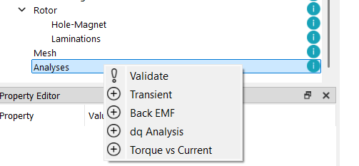
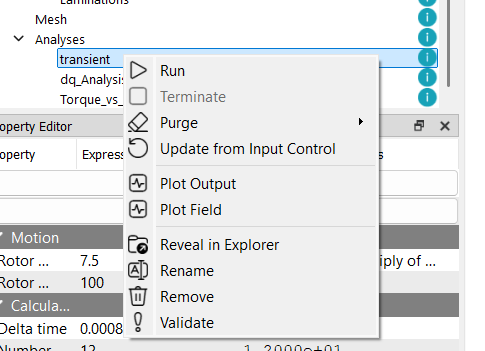
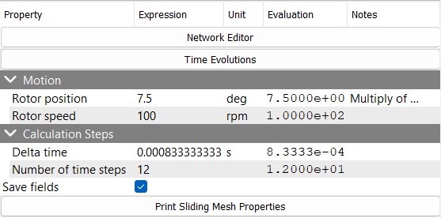

# Transient Analysis
To add a transient analysis, right-click on the `Analysis` milestone in the project tree and select `Transient`. This will create a new transient analysis node under the `Analysis` milestone with a unique name. This will make a new folder in the project directory with the given name and create a new EMSolution's input control file in JSON format.

A new tab will be also added project window with the name of the analysis. The tab will contain the following sub-sections:
* **Input Control**: This tab shows the input control file in JSON format. The user can edit the file directly in this tab. This tab also has `Run` and `Terminate` buttons to run or terminate the EMSolution.
* **JSON View**: This is a read-only view of the all the json files in the analysis folder. The user can view the input control file, mesh files, and other files related to the analysis.

To rename, remove, validate or reveal the corresponding folder, right-click on the analysis checkpoint and select the appropriate option from the context menu. 

## Transient Analysis Settings

<!-- TODO: Sakai-san -->
<!-- TODO: Kaimori-san -->

...

## Running the Analysis
To run the analysis, click on the `Run` button in the corresponding analysis tab or right-click on the analysis checkpoint in the project tree and select `Run`. The analysis will be executed, and the results will be saved in the corresponding folder.

:::warning
Prior to running the analysis, eMotorSolution will check for the existance of the mesh files in the corresponding folder. If the mesh files are not found, they will be copied from the `Mesh` folder. Otherwise, the existing mesh files will be used.

If the mesh files are changed, it is recommended to delete the existing mesh files by right-clicking on the analysis checkpoint in the project tree and selecting `Purge > Purge All`. This will ensure that the analysis uses the latest mesh files.

The `Purge > Purge Solutions` option will delete all the solution files without deleting the mesh files. This is useful if you want to keep the mesh files but remove the old solution files to free up space.
:::

## Results
The field results and the output results can be viewed by right-clicking on the analysis checkpoint in the project tree and selecting `Plot Field` or `Plot Output`. The field results will be displayed in the `Field` tab, and the output results will be displayed in the `Output` tab. The results can be plotted using the built-in plotting tools.