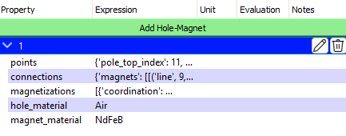
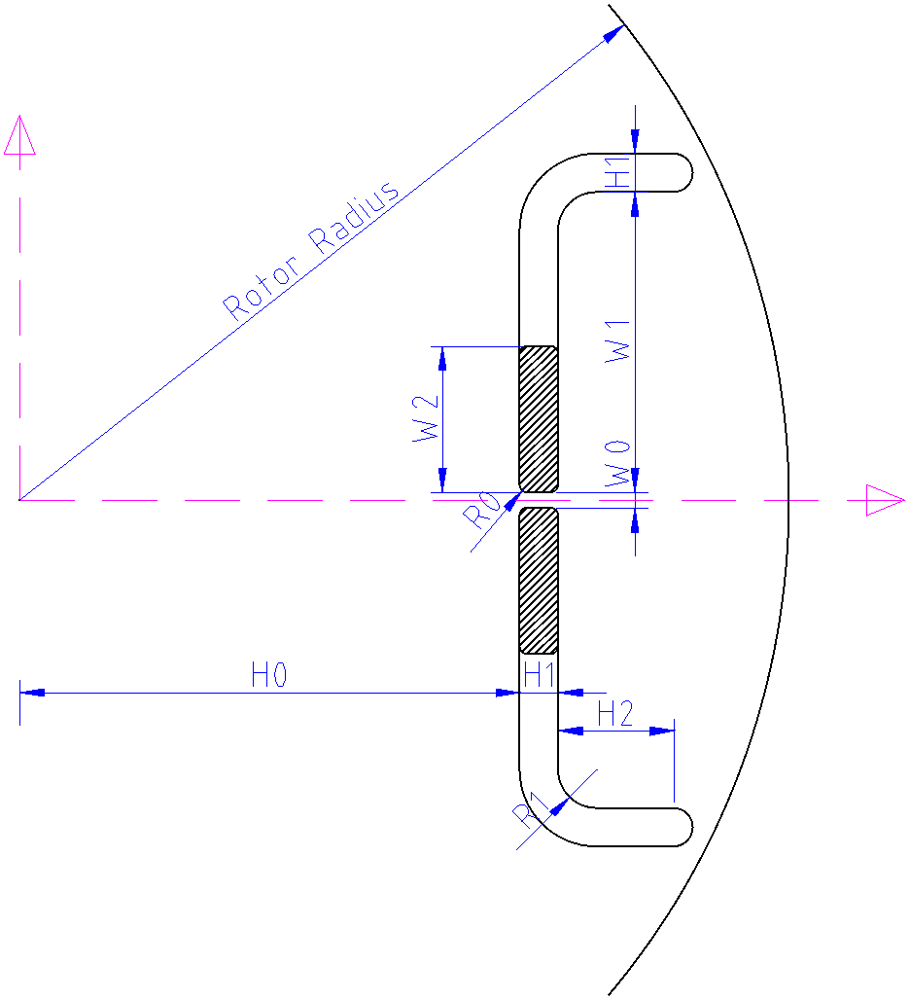
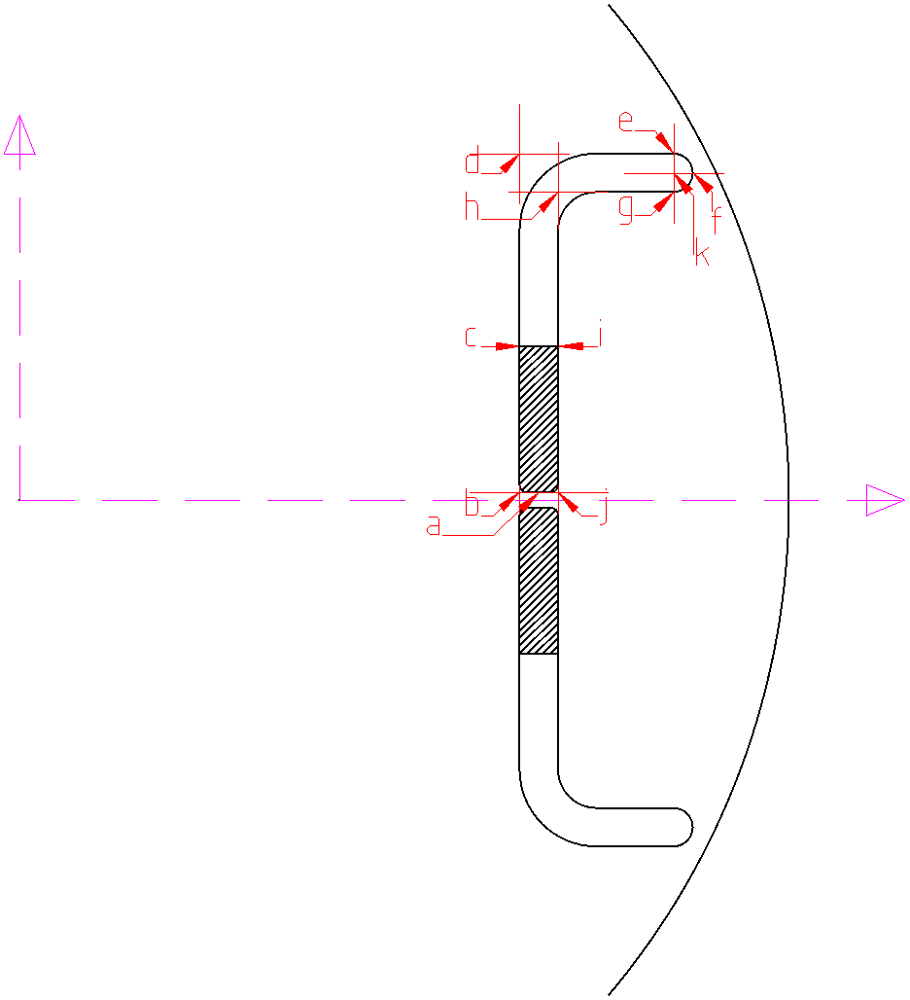

# User Defined Interior Permanent Magnet (IPM) 
The interior permanent magnet machines may have multiple holes with multiple permanent magnets in each hole. Each permanent magnet can also have its own magnetization direction.

The user-defined Hole-Magnet, takes three parameters: `Points`, `Connections`, and `Magnetization`.

<p class="ems"></p>

By default, a `Hole Type 52` is created when a user-defined IPM is selected. By clicking on the <span style={{ fontFamily: 'Segoe Fluent Icons', fontSize: '1.0em' }}>&#xE70F;</span> **Edit** button, a dialog will open where you can edit the `Points`, `Connections`, and `Magnetization` interactively.

<p class="ems"></p>

## Points
The `Points` dictionary contains the coordinates of the points that define the holes and magnets and the index of center-line points. The template for the `Points` dictionary is as follows:

```python
{
    "points": {
        "point0": [point0_x_coordinate, point0_y_coordinate],
        "point1": [point1_x_coordinate, point1_y_coordinate],
        ...
    },
    "pole_top_index": "point_x",
    "pole_bottom_index": "point_y",
}
```

:::warning
The following remarks should be strictly followed:
- The slot should be aligned with the x-axis.
- Point coordinates should be given in meters.
- The keys in the `points` dictionary should be unique strings that represent the point names. Other keys like integer or float values are not allowed.
:::

## Connections
The `Connections` dictionary defines how the points in the `Points` dictionary are connected to form the hole and magnet geometries. The template for the `Connections` dictionary is as follows:

```python
{
    "holes": [
        [    # First hole
            ["connection_type", "parameter1", "parameter2", ...],
            ["connection_type", "parameter1", "parameter2", ...], 
        ],
        [    # Second hole
            ["connection_type", "parameter1", "parameter2", ...],
            ["connection_type", "parameter1", "parameter2", ...], 
        ],
    ],
    "magnets": [
        [   # First magnet
            ["connection_type", "parameter1", "parameter2", ...],
            ["connection_type", "parameter1", "parameter2", ...], 
        ],
        [   # Second magnet
            ["connection_type", "parameter1", "parameter2", ...],
            ["connection_type", "parameter1", "parameter2", ...], 
        ],
    ],
}
```

The connections should close the geometry of the slot and windings. And the sequence of the connections should be in counter-clockwise direction.

:::info
Currently, the following connection types are supported:
- **line**: Connects two points with a straight line.
    - *Syntax*: `("line", "point1", "point2")`
- **arc**: Connects two points with an arc. 
    - *Syntax*: `("arc", "start_point", "center_point", "end_point")`
- **arc3p**: Connects two points with an arc defined by three points.
    - *Syntax*: `("arc3p", "start_point", "middle_point", "end_point")`
- **fillet**: Connects two lines with a fillet.
    - *Syntax*: `("fillet", "point1", "intersection_point", "point2", radius)`
:::

## Magnetization
In contrast to `points` and `connections`, the `magnetization` is a list of dictionaries, where each dictionary defines the magnetization direction for the magnets defined in `connections`. Each magnet can have its own magnetization type, `cartesian` or `polar`. In case of `cartesian`, the magnetization is defined by a starting and ending point, while in case of `polar`, the magnetization is defined by the `polar_center_point`.

```python
[
    {
        "coordination": "cartesian",
        "starting_point": "point_x",
        "ending_point": "point_y",
    },
    {
        "coordination": "polar",
        "polar_center_point": [x_coordinate, y_coordinate],
    },
]
```

## Example
It is recommanded to define the points and connections in [Script](https://emsolution-ssil.github.io/eMotorSolutionDoc/docs/docs/script) checkpoint, since it gives more flexibility and allows to use python functions.

In this example, we will create a user-defined IPM with two holes and two magnets, where both magnets have the same magnetization direction in x-direction.

<p class="ems"></p>

The points and connections are defined as follows:

<p class="ems"></p>

```python
import ems

H0 = 65e-3  # m
H1 = 4e-3  # m
H2 = 5e-3  # m
W0 = 2e-3  # m
W1 = 20e-3  # m
W2 = 10e-3  # m
R0 = 1e-3  # m
R1 = 3e-3  # m

point_a_x = H0 + H1 / 2
point_a_y = W0 / 2

point_b_x = H0
point_b_y = W0 / 2

point_c_x = H0
point_c_y = point_b_y + W2

point_d_x = H0
point_d_y = point_b_y + W1 + H1

point_e_x = H0 + H1 + H2
point_e_y = point_d_y

point_f_x = point_e_x + H1 / 2
point_f_y = point_e_y - H1 / 2

point_g_x = point_e_x
point_g_y = point_e_y - H1

point_h_x = H0 + H1
point_h_y = point_g_y

point_i_x = point_c_x + H1
point_i_y = point_c_y

point_j_x = point_b_x + H1
point_j_y = point_b_y

point_k_x = point_e_x
point_k_y = point_e_y - H1 / 2

point_x_x = H0
point_x_y = 0

pts = {
    "pole_top_index": "x",
    "pole_bottom_index": "x",
    "points": {
        "a_top": (point_a_x, point_a_y),
        "b_top": (point_b_x, point_b_y),
        "c_top": (point_c_x, point_c_y),
        "d_top": (point_d_x, point_d_y),
        "e_top": (point_e_x, point_e_y),
        "f_top": (point_f_x, point_f_y),
        "g_top": (point_g_x, point_g_y),
        "h_top": (point_h_x, point_h_y),
        "i_top": (point_i_x, point_i_y),
        "j_top": (point_j_x, point_j_y),
        "k_top": (point_k_x, point_k_y),
        "a_bottom": (point_a_x, -point_a_y),
        "b_bottom": (point_b_x, -point_b_y),
        "c_bottom": (point_c_x, -point_c_y),
        "d_bottom": (point_d_x, -point_d_y),
        "e_bottom": (point_e_x, -point_e_y),
        "f_bottom": (point_f_x, -point_f_y),
        "g_bottom": (point_g_x, -point_g_y),
        "h_bottom": (point_h_x, -point_h_y),
        "i_bottom": (point_i_x, -point_i_y),
        "j_bottom": (point_j_x, -point_j_y),
        "k_bottom": (point_k_x, -point_k_y),
        "x": (point_b_x, point_x_y),
    },
}

cns = {
    "holes": [
        [
            ("fillet", "a_top", "b_top", "c_top", R0),
            ("fillet", "c_top", "d_top", "e_top", R1 + H1),
            ("arc", "e_top", "k_top", "f_top"),
            ("arc", "f_top", "k_top", "g_top"),
            ("fillet", "g_top", "h_top", "i_top", R1),
            ("fillet", "i_top", "j_top", "a_top", R0),
        ],
        [
            ("fillet", "c_bottom", "b_bottom", "a_bottom", R0),
            ("fillet", "a_bottom", "j_bottom", "i_bottom", R0),
            ("fillet", "i_bottom", "h_bottom", "g_bottom", R1),
            ("arc", "g_bottom", "k_bottom", "f_bottom"),
            ("arc", "f_bottom", "k_bottom", "e_bottom"),
            ("fillet", "e_bottom", "d_bottom", "c_bottom", R1 + H1),
        ],
    ],
    "magnets": [
        [
            ("fillet", "a_top", "b_top", "c_top", R0),
            ("line", "c_top", "i_top"),
            ("fillet", "i_top", "j_top", "a_top", R0),
        ],
        [
            ("fillet", "a_bottom", "b_bottom", "c_bottom", R0),
            ("line", "c_bottom", "i_bottom"),
            ("fillet", "i_bottom", "j_bottom", "a_bottom", R0),
        ],
    ],
}

mgs = [
    {"coordination": "cartesian", "starting_point": "c_top", "ending_point": "i_top"},
    {
        "coordination": "cartesian",
        "starting_point": "c_bottom",
        "ending_point": "i_bottom",
    },
]

ems.update_parameters(
    {
        "pts": pts,
        "cns": cns,
        "mgs": mgs,
    }
)

```

<a className="button" target="_blank" href={ require("/UserDefinedIPM.zip").default } download>Download The User Defined IPM Project</a>