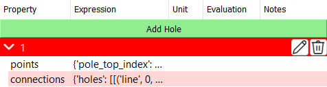

# User Defined Synchronous Reluctance Motor (SynRM)
The synchronous reluctance motor (SynRM) can have multiple holes. The user-defined SynRM takes two parameters: `Points` and `Connections`.

<p class="ems"></p>

By default, a `Hole Type 61` is created when a user-defined SynRM is selected. By clicking on the <span style={{ fontFamily: 'Segoe Fluent Icons', fontSize: '1.0em' }}>&#xE70F;</span> **Edit** button, a dialog will open where you can edit the `Points` and `Connections` interactively.

<p class="ems"></p>

## Points
The `Points` dictionary contains the coordinates of the points that define the slots and magnets and the index of center-line points. The template for the `Points` dictionary is as follows:

```python
{
    "points": {
        "point0": [point0_x_coordinate, point0_y_coordinate],
        "point1": [point1_x_coordinate, point1_y_coordinate],
        ...
    },
    "pole_top_index": "point_x",
    "pole_bottom_index": "point_y",
}
```

:::warning
The following remarks should be strictly followed:
- The slot should be aligned with the x-axis.
- Point coordinates should be given in meters.
- The keys in the `points` dictionary should be unique strings that represent the point names. Other keys like integer or float values are not allowed.
:::

## Connections
The `Connections` dictionary defines how the points in the `Points` dictionary are connected to form the slot geometries. The template for the `Connections` dictionary is as follows:

```python
{
    "slots": [
        [   # First slot
            ["connection_type", "parameter1", "parameter2", ...],
            ["connection_type", "parameter1", "parameter2", ...], 
        ],
        [   # Second slot
            ["connection_type", "parameter1", "parameter2", ...],
            ["connection_type", "parameter1", "parameter2", ...], 
        ],
    ]
}
```

The connections should close the geometry of the slot and windings. And the sequence of the connections should be in counter-clockwise direction.

:::info
Currently, the following connection types are supported:
- **line**: Connects two points with a straight line.
    - *Syntax*: `("line", "point1", "point2")`
- **arc**: Connects two points with an arc. 
    - *Syntax*: `("arc", "start_point", "center_point", "end_point")`
- **arc3p**: Connects two points with an arc defined by three points.
    - *Syntax*: `("arc3p", "start_point", "middle_point", "end_point")`
- **fillet**: Connects two lines with a fillet.
    - *Syntax*: `("fillet", "point1", "intersection_point", "point2", radius)`
:::

## Example
It is recommanded to define the points and connections in [Script](https://emsolution-ssil.github.io/eMotorSolutionDoc/docs/docs/script) checkpoint, since it gives more flexibility and allows to use python functions.

In this example, we will create a user-defined SynRM with two holes.

<p class="ems"></p>

The points and connections are defined as follows:

<p class="ems"></p>

```python
import ems

H0 = 65e-3  # m
H1 = 2e-3  # m
H2 = 5e-3  # m
W0 = 2e-3  # m
W1 = 15e-3  # m
R0 = 0.5e-3  # m
R1 = 3e-3  # m

point_a_x = H0 + H1 / 2
point_a_y = W0 / 2

point_b_x = H0
point_b_y = W0 / 2

point_c_x = H0
point_c_y = W0 / 2 + W1 - R1

point_d_x = H0 + H1 + R1
point_d_y = point_c_y + H1 + R1

point_e_x = H0 + H1 + H2
point_e_y = W0 / 2 + W1 + H1

point_f_x = point_e_x + H1 / 2
point_f_y = point_e_y - H1 / 2

point_g_x = point_e_x
point_g_y = point_e_y - H1 / 2

point_h_x = point_e_x
point_h_y = point_e_y - H1

point_k_x = H0 + H1 + R1
point_k_y = point_c_y

point_j_x = point_k_x
point_j_y = point_k_y + R1

point_m_x = H0 + H1
point_m_y = point_c_y

point_n_x = H0 + H1
point_n_y = W0 / 2

point_x_x = H0
point_x_y = 0

pts = {
    "pole_top_index": "x",
    "pole_bottom_index": "x",
    "points": {
        "a_top": (point_a_x, point_a_y),
        "b_top": (point_b_x, point_b_y),
        "c_top": (point_c_x, point_c_y),
        "d_top": (point_d_x, point_d_y),
        "e_top": (point_e_x, point_e_y),
        "f_top": (point_f_x, point_f_y),
        "g_top": (point_g_x, point_g_y),
        "h_top": (point_h_x, point_h_y),
        "j_top": (point_j_x, point_j_y),
        "k_top": (point_k_x, point_k_y),
        "m_top": (point_m_x, point_m_y),
        "n_top": (point_n_x, point_n_y),
        "a_bottom": (point_a_x, -point_a_y),
        "b_bottom": (point_b_x, -point_b_y),
        "c_bottom": (point_c_x, -point_c_y),
        "d_bottom": (point_d_x, -point_d_y),
        "e_bottom": (point_e_x, -point_e_y),
        "f_bottom": (point_f_x, -point_f_y),
        "g_bottom": (point_g_x, -point_g_y),
        "h_bottom": (point_h_x, -point_h_y),
        "j_bottom": (point_j_x, -point_j_y),
        "k_bottom": (point_k_x, -point_k_y),
        "m_bottom": (point_m_x, -point_m_y),
        "n_bottom": (point_n_x, -point_n_y),
        "x": (point_b_x, point_x_y),
    },
}

cns = {
    "holes": [
        [
            ("fillet", "a_top", "b_top", "c_top", R0),
            ("arc", "c_top", "k_top", "d_top"),
            ("line", "d_top", "e_top"),
            ("arc", "e_top", "g_top", "f_top"),
            ("arc", "f_top", "g_top", "h_top"),
            ("line", "h_top", "j_top"),
            ("arc", "j_top", "k_top", "m_top"),
            ("fillet", "m_top", "n_top", "a_top", R0),
        ],
        [
            ("fillet", "a_bottom", "b_bottom", "c_bottom", R0),
            ("arc", "c_bottom", "k_bottom", "d_bottom"),
            ("line", "d_bottom", "e_bottom"),
            ("arc", "e_bottom", "g_bottom", "f_bottom"),
            ("arc", "f_bottom", "g_bottom", "h_bottom"),
            ("line", "h_bottom", "j_bottom"),
            ("arc", "j_bottom", "k_bottom", "m_bottom"),
            ("fillet", "m_bottom", "n_bottom", "a_bottom", R0),
        ],
    ]
}


ems.update_parameters(
    {
        "pts": pts,
        "cns": cns,
    }
)
```
<a className="button" target="_blank" href={ require("/UserDefinedSynRM.zip").default } download>Download The User Defined SynRM Project</a>
