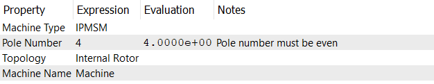

# Type Checkpoint

## Machine Type
Currently, the software supports three types of machines: 
* **IPMSM**: Interior Permanent Magnet Synchronous Motor
* **SPMSM**: Surface Permanent Magnet Synchronous Motor
* **SynRM**: Synchronous Reluctance Motor

## Pole Number
The pole number is the number of magnetic poles in the machine. 
:::info
Pole number should be a positive even number.
:::

## Topology
The topology of the machine can be either **Internal Rotor** or **External Rotor**.

## Machine Name
The machine name is a user-defined string that identifies the machine. It can be any alphanumeric string, including spaces and special characters. The name is used to label the machine in the project tree and in the output files.
