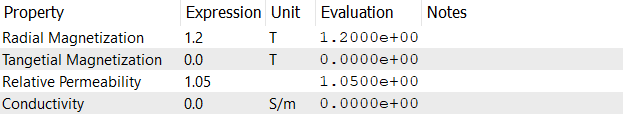

# Magnet
Magnets are characterized by their magnetization direction and strength. The magnetization direction is the direction of the magnetic field lines, while the strength is the magnitude of the magnetic field. The strength of a magnet can be measured in Tesla (T) or Gauss (G), with 1 T = 10,000 G. The relative permeability of a magnet is a measure of how easily it can be magnetized in the presence of an external magnetic field. The relative permeability is defined as the ratio of the magnetic field strength inside the material to the magnetic field strength outside the material. It is possible to take the conductivty of the magnet into account to calculate the ohmic losses in the magnet. 

The following properties are defined for the magnet:
- **Radial Magnetization**: Specifies the magnetization strength in the radial direction for cylindrical magnets and normal direction for rectangular magnets. It is measured in Tesla (T) or Gauss (G).
- **Tangential Magnetization**: Specifies the magnetization strength in the tangential direction. It is measured in Tesla (T) or Gauss (G).
- **Relative Permeability**: Specifies the relative permeability of the magnet material. It is a dimensionless quantity.
- **Conductivity**: Specifies the conductivity of the magnet material. It is measured in Siemens per meter (S/m). Default is 0 S/m.

