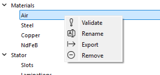
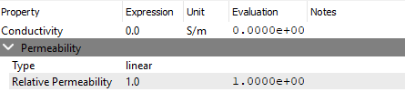
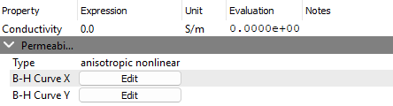
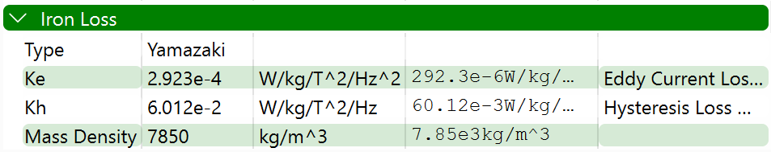
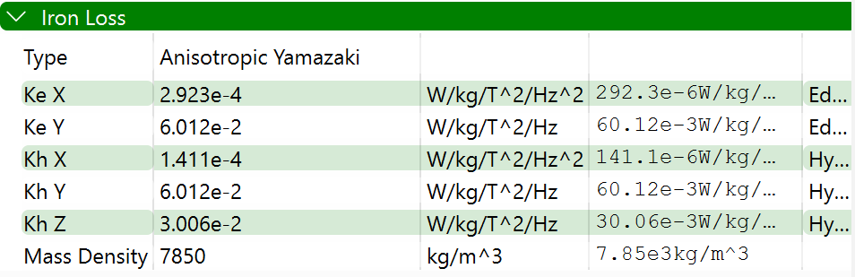

The `non-magnet` material refers to materials such as conducting materials in windings, core materials on the staor and rotor, air, vaccuum, etc.

To add a new non-magnet material, you can right-click on the `Materials` milestone and select `Add Non-Magnet Material`. This will create a new non-magnet material with the default properties. You can then modify the properties of the material as needed from the `Properties` panel.
<p align="center"></p>

Each material can be validated, renamed, exported, and removed by right-clicking on the material in the `Materials` milestone. The `Validate` option will check if the material properties are valid and will display a message if there are any errors. The `Rename` option allows you to change the name of the material if it was not set to anything. The `Export` option will export the material properties in JSON format, which can be used to import the material into another project. The `Remove` option will delete the material from the project.
<p align="center"></p>

## Permeability Types

There are three types of non-magnet materials:
- **Linear**: This is the default type of non-magnet material. It has a constant permeability and conductivity.
- **Nonlinear**: This type of non-magnet material has a non-linear permeability but a constant conductivity.
- **Anisotropic Nonlinear**: With a constant conductivity, the permeability is different in different directions. 

### Linear Type
The linear type of non-magnet material has a constant permeability and conductivity. The properties of the material are defined by the following parameters:
- **Conductivity**: The constant conductivity of the material. The units are `S/m`, `S/cm`, `S/mm`, `S/um`, and `S/nm`. The default value is `0 S/m`.
- **Relative Permeability**: The constant relative permeability of the material. Since it is a dimensionless quantity, it does not have any units. The default value is `1`.

<p align="center"></p>

The JSON format of the linear type of non-magnet material is as follows:
```json
{
    "type": "non_magnet",
    "name": "Air",
    "_conductivity_expression": "0.0",
    "_conductivity_unit": "S/m",
    "permeability_type": "linear",
    "permeability": {
        "_relative_permeability_expression": "1.0"
    }
}
```

### Nonlinear Type
The nonlinear non-magnet material is suitable for materials with a non-linear permeability but a constant conductivity. The properties of the material are defined by the following parameters:
- **Conductivity**: The constant conductivity of the material. The units are `S/m`, `S/cm`, `S/mm`, `S/um`, and `S/nm`. The default value is `0 S/m`.
- **B-H Curve**: The B-H curve of the material. The B-H curve is a non-linear function that describes the relationship between the magnetic field strength (H) and the magnetic flux density (B). The B-H curve can be defined by a set of points in the form of `H` and `B` values. The units are `A/m` and `T`, respectively.
<p align="center"></p>
To edit the B-H curve, click on the `Edit` button in the `B-H Curve` section. This will open a new window where you can add, edit, and delete points in the B-H curve. You can also import and export the B-H curve data in CSV format.
<p align="center"></p>

The JSON format is as follows:
```json
{
    "type": "non_magnet",
    "name": "Steel",
    "_conductivity_expression": "0.0",
    "_conductivity_unit": "S/m",
    "permeability_type": "nonlinear",
    "permeability": {
        "b_unit": "T",
        "h_unit": "A/m",
        "data": [
            [
                0.0,
                0.0
            ],
            [
                1.0,
                1.0
            ],
            [
                2.0,
                1.5
            ]
        ]
    }
}
```

### Anisotropic Nonlinear Type
The materials with nonlinear permeability in different directions are called anisotropic nonlinear materials. The properties of the material are defined by the following parameters:
- **Conductivity**: The constant conductivity of the material. The units are `S/m`, `S/cm`, `S/mm`, `S/um`, and `S/nm`. The default value is `0 S/m`.
- **B-H Curve X**: The B-H curve of the material in the X direction. 
- **B-H Curve Y**: The B-H curve of the material in the Y direction.
<p align="center"></p>
The modification of the B-H curve is similar to the nonlinear type. 

The JSON format is as follows:
```json
{
    "type": "non_magnet",
    "name": "Steel",
    "_conductivity_expression": "0.0",
    "_conductivity_unit": "S/m",
    "permeability_type": "anisotropic nonlinear",
    "permeability": {
        "b_unit": "T",
        "h_unit": "A/m",
        "x_data": [
            [
                0.0,
                0.0
            ],
            [
                1.0,
                1.0
            ]
        ],
        "y_data": [
            [
                0.0,
                0.0
            ],
            [
                1.0,
                1.0
            ]
        ]
    }
}
```

## Iron Losses

Two types of iron losses can be defined for non-magnet materials:
- **Yamazaki**: This type of iron loss is based on the Yamazaki model. The properties of the Yamazaki iron loss are defined by the following parameters:
  - **Ke**: The coefficient of the eddy current loss.
  - **Kh**: The coefficient of the hysteresis loss.
  - **Mass Density**: The mass density of the material.

<p align="center"></p>

- **Anisotropic Yamazaki**: This type of iron loss is based on the anisotropic Yamazaki model. The properties of the anisotropic Yamazaki iron loss are defined by the following parameters:
  - **Ke X**: The coefficient of the eddy current loss in the X direction.
  - **Kh X**: The coefficient of the hysteresis loss in the X direction.
  - **Ke Y**: The coefficient of the eddy current loss in the Y direction.
  - **Kh Y**: The coefficient of the hysteresis loss in the Y direction.
  - **Kh Z**: The coefficient of the hysteresis loss in the Z direction.
  - **Mass Density**: The mass density of the material.

<p align="center"></p>