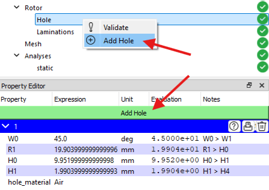
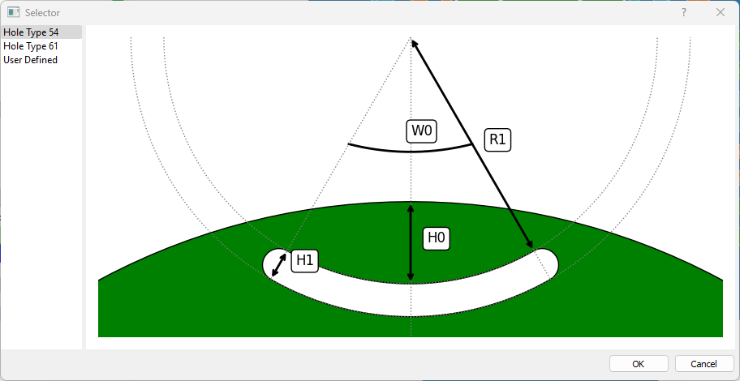

# Hole Checkpoint
This type of checkpoint appears in the rotor milestone if the machine type is **SynRM**. This type of machine may have multiple set of holes. And each hole has its own independent geometrical and material properties. 

To add a new hole, click on the **Add Hole** button in the property editor panel or right-click on the **Hole** checkpoint in the project tree and select **Add Hole** from the context menu.

The software provides a set of commonly used holes. Although the user can create a custom hole pair as well by choosing **User Defined** option. The following figure shows the list of available hole-magnet pairs.

The geometrical and material properties of each hole-magnet pair are given in their respective section in the property editor panel. Each section contains &#xE9CE; button to preview the hole shape, and &#xEC5B; button to print the hint values in the log panel and &#xE74D; button to delete that hole shape.
