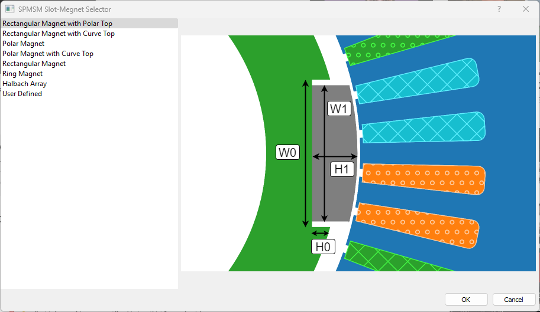

# Slot-Magnet Checkpoint
When the machine type is **SPMSM**, this checkpoint appears in the rotor milestone. SPMSM machines only have a single set of slot-magnet pair.

To choose a slot-magnet pair, click on the **Choose Slot-Magnet** button in the property editor panel. A dialog box will appear with a list of available slot-magnet pairs. The user can select one of the available slot-magnet pairs or create a custom one with **User Defined** option.

The geometrical and material properties of the slot-magnet pair are given in their respective section in the property editor panel. Since the slot-magnet pair has a single set of magnets, the magnet material applies to all the magnets in the rotor. &#xE9CE; button is used to preview the slot-magnet pair shape, &#xEC5B; button is used to print the hint values in the log panel.