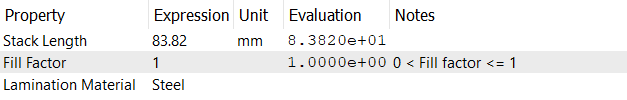

# Lamination
This checkpoint simply specifies the stator core parameters. The following properties are defined:
- **Stack Length**: Specifies the length of the stator core.
- **Fill Factor**: Specifies the fill factor of the stator core. The fill factor is the ratio of the area occupied by the laminations to the total length of the stator core. It is a dimensionless quantity between 0 and 1.
- **Lamination Material**: Specifies the material of the stator core. The material is selected from the list of available materials. The list of available materials is defined in the `Material` checkpoint.

