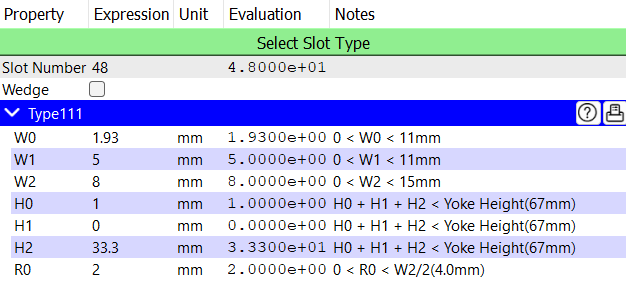
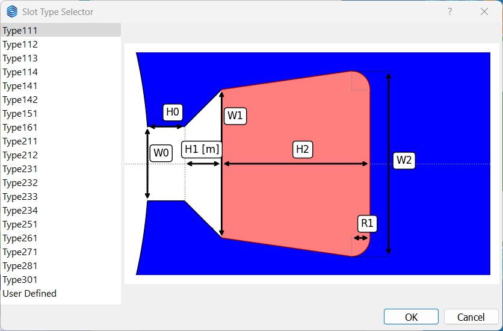
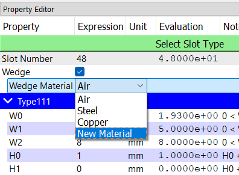
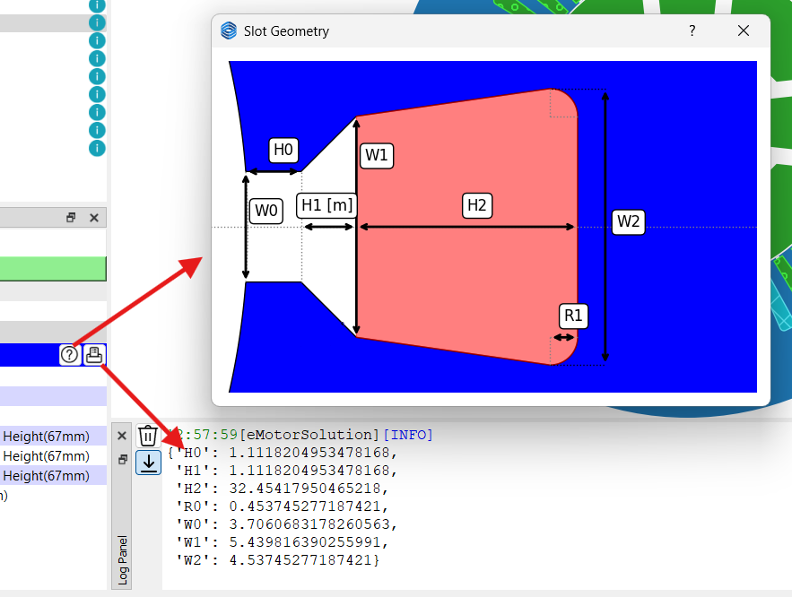

# Slot Checkpoint

This checkpoint defines the number of slots, slot type, the parameters of the selected slot type, and the wedge properties. The following figure shows the slot properties for slot type 111.

## Slot Type
By clicking on the **Select Slot Type** button, you can choose the desired slot type from the list of available slot types that are shown in the popup window. 
Currently 19 types of frequently used slot shapes are available. The number of parameters for each slot type is different. 
:::warning
Slot type 161 is only available for the outer rotor machines.
:::

## Wedge
By default, the wedge checkbox is unchecked, which means that the wedge is not included in the slot and it is filled with air.
If the wedge checkbox is checked, the `wedge material` combobox will be appeared below the wedge checkbox. The combobox contains the list of non-magnet materials to choose from.

## Slot Properties
Depending on the selected slot type, the slot properties are different. To preview the slot shape, click on the &#xE9CE; button inside the Property Editor panel. This will open a pop-up window where you can check the slot shape. 

To print the hint values for the selected slot type, click on the &#xEC5B; button inside the Property Editor panel. This will print the hint values in the log panel. The hint values are the default values for the selected slot type and can be used as a reference for defining the slot properties.

