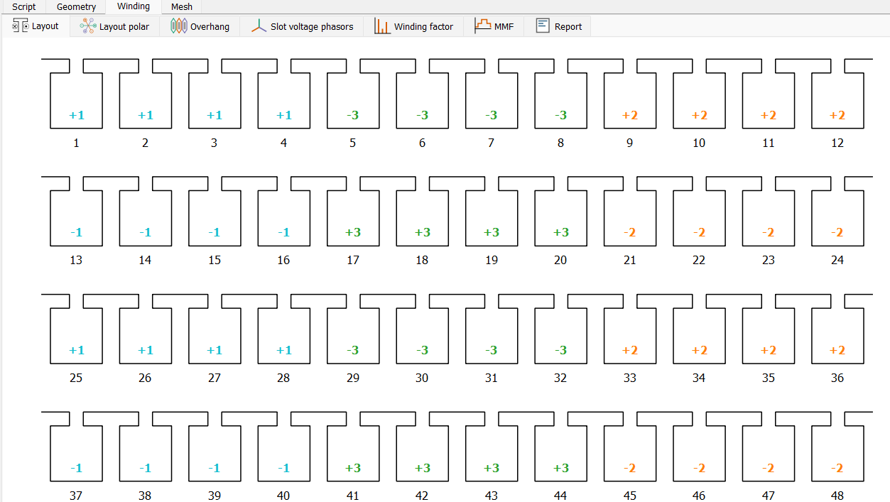

# Winding Checkpoint
The winding configuration has the following properties:

- **Winding Material**: The winding material is selected from the list of available materials. The list contains all the materials that are defined in the `Materials` checkpoint. 
- **Phase Number**: The number of phases in the machine. The default value is 3.
- **Layer Configuration**: Three types of layer configurations are available: `Single`, `Distributed`, and `Concentrated`. 
    - **Single**: A single layer of winding is placed in the slot. 
    - **Distributed**: Each slot contains two layers of winding. The first layer is placed in the slot, and the second layer is placed on top of the first layer. The second layer is shifted in accordance with the coil span.
    - **Concentrated**: Each slot contains two layers of winding that are placed next to each other to form a concentrated winding. 
- **Turns per Coil**: The number of turns in each coil. 
- **Parallel Paths**: The number of parallel paths in the winding. The default value is 1.
- **Coil Span**: Takes effect for the `Distributed` layer configuration only. For the `Concentrated` layer configuration, the coil span should be equal to 1; and for the `Single` layer configuration, the coil span should be equal to coil pitch. 

Visualization of the winding configuration is available in the winding tab

