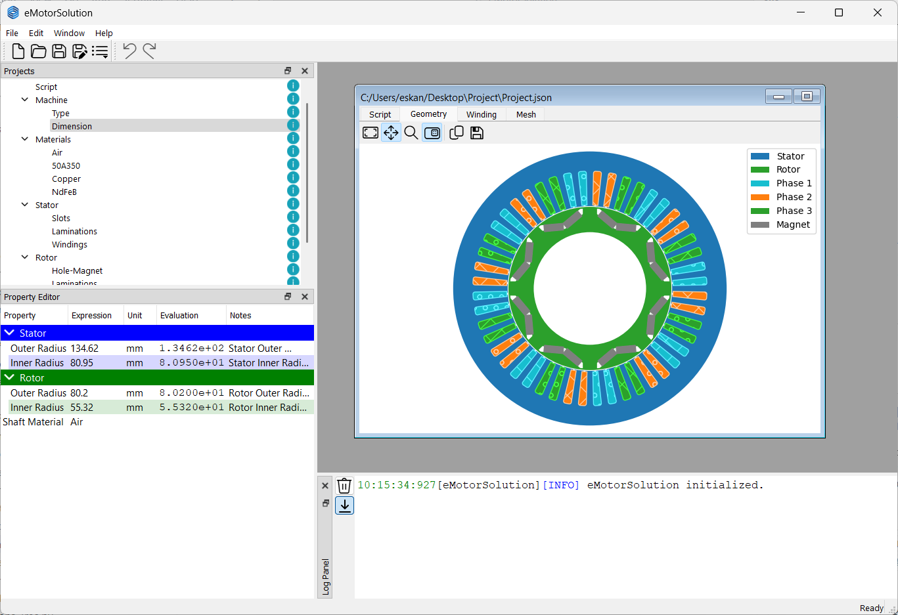

# Main Window

The main window of the software is divided into three main panels:
* **Project panel** : displaying the project tree and allowing to manage the project
* **Properties panel** : displaying the properties of the selected item in the project tree in a tabular format
* **Log panel** : displaying the log messages and errors
The main window also contains a menu bar and a toolbar for quick access to common functions.

## Projects Panel
The project tree is a hierarchical representation of the project roadmap. It allows the user to navigate through the different milestones and checkpoints of the project. The project tree is divided into several sections, each representing a different part of the project. The user can expand or collapse each section to view or hide its contents.
The project tree is organized in a way that reflects the different stages of the project. Each section represents a different part of the project, and each item in the section represents a specific milestone or checkpoint. The user can click on each item to view its properties in the properties panel.

* **Script checkpoint** : providing parameters definition and python scripting environment
* **Machine milestone** : setting the machine type and main dimensions
* **Materials milestone** : managing material definitions
* **Stator milestone** : stator slot geometry and winding configuration
* **Rotor milestone** : rotor slot-magnet configurations
* **Mesh checkpoint** : mesh specification
* **Analysis milestone** : defining and running different types of analysis

Each milestone or checkpoint is associated with a state given by an icon on the left side. The state can be:
| State   | Icon | Description                                            |
|---------|------|--------------------------------------------------|
| Initial |   |The milestone is not yet verified                      |
| Valid   |   |The milestone is verified and all parameters are feasible |
| Warning |   |Some parameters in the sub-checkpoint are not feasible |
| Invalid |   |There is an error in the associated parameters         |

Each checkpoint is automatically verified when the user makes any changes. However, the user can also manually verify the checkpoint by right-clicking on it and selecting `Validate` from the context menu. The verification process will check all parameters and sub-checkpoints and update the state of the milestone accordingly. If there is an error in the parameters, a message will be displayed in the `Log` panel.

## Properties Panel
The properties panel displays the properties of the selected item in the project tree. The properties are displayed in a tabular format with 5 columns: *Property*, *Expression*, *Unit*, *Evaluation* and *Notes*.

:::tip
The user can edit the properties by clicking on the cell in the *Expression* column. Since the cells may have small space, user can click on the button on the right side of the cell to open a pop-up window with a larger text area. 
:::

The expression is a pythonic mathematical expression that can be evaluated using the python interpreter. User can use `numpy` expressions as `np`. Here are some examples of expressions:
* `2 * 3 + 4` : evaluates to `10`
* `np.pi` : evaluates to `3.141592653589793`
* `np.sqrt(4)` : evaluates to `2.0`
* `np.sin(np.pi/2)` : evaluates to `1.0`
* `parameter1 + parameter2` : evaluates to the sum of the two parameters defined in `Script` checkpoint.

:::info
To learn more about `numpy` expressions, please refer to the [numpy documentation](https://numpy.org/doc/stable/user/absolute_beginners.html).
:::

Some properties may have a unit associated with them. The unit is displayed in the *Unit* column. The final evaluation of the expression in SI units is displayed in the *Evaluation* column. 

Extra information about the properties are displayed in the *Notes* column. In case of invalid expression, the row will be highlighted in red and the error message will be displayed in the *Log* panel and the *Notes* column. 

## Log Panel
The log panel displays the log messages and errors. Each message is displayed with a timestamp, project name, severity level and message.

To clear the log panel, the user can click on the trash icon on the top left corner of the panel or using the `Ctrl + K` shortcut. 