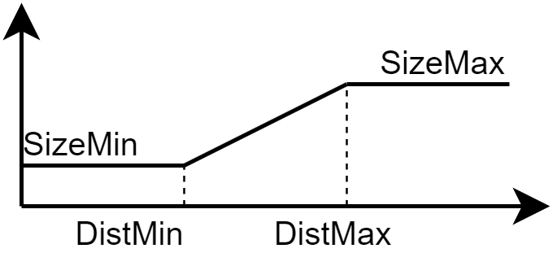

# Mesh Checkpoint

The mesh properties are defined in this checkpoint. The following properties are available:

To generate the mesh, right-click on the **Mesh** checkpoint in the project tree and select **Generate Mesh** from the context menu or click on the &#xE768; button in mesh tab. If the geometry has passed the validation, the mesh will be generated. The mesh generation process may take some time depending on the complexity of the geometry and the selected algorithm.

### Algorithm
The algorithm used for the mesh generation. The available algorithms are:
    1. MeshAdapt
    2. Automatic
    3. Initial mesh only
    4. Delaunay
    5. Frontal-Delaunay
    6. BAMG
    7. Frontal-Delaunay for Quads
    8. Packing of Parallelograms
    9. Quasi-structured Quad

### Max Element Size
The maximum size of the elements in the mesh. 

### Recombine / Recombination Algorithm
The recombine checkbox. If checked, the mesh will be recombined to form quadrilateral elements. 

The available recombination algorithms are:
    1. simple
    2. blossom
    3. simple full-quad
    4. blossom full-quad

### Full Mesh
The full mesh checkbox. If checked, the mesh will be generated for the entire geometry.

### Segmentation
The segmentation checkbox. If checked, segmentation lines will be generated for the mesh.

### Silent
The silent checkbox. If checked, the mesh generation will be silent and no messages will be displayed in the log panel.

### Airgap
- **Tangential Divisions**:  The number of mesh divisions in the tangential direction of the airgap line.
- **Radial Divisions**: The number of mesh divisions in the radial direction of the airgap area.

### Stator
The mesh size in the stator region is a function of distance from the airgap line. The mesh size from the airgap line to `DistMin` is `SizeMin`, and the mesh size from `DistMax` to the stator outer radius is `SizeMax`. The mesh size between `DistMin` and `DistMax` is linearly interpolated. 

The mesh size in the stator region is defined as follows:
- **DistMin**: The distance up to which the mesh size is `SizeMin`.
- **DistMax**: The distance after which the mesh size is `SizeMax`.
- **SizeMin**: The mesh size when the distance from the airgap line is less than `DistMin`.
- **SizeMax**: The mesh size when the distance from the airgap line is greater than `DistMax`.
- **Windings**: The mesh size in the windings region.

### Rotor
Similar to the stator region, that is defined as follows:
- **DistMin**: The distance up to which the mesh size is `SizeMin`.
- **DistMax**: The distance after which the mesh size is `SizeMax`.
- **SizeMin**: The mesh size when the distance from the airgap line is less than `DistMin`.
- **SizeMax**: The mesh size when the distance from the airgap line is greater than `DistMax`.
- **Holes**: The mesh size in the holes region. (only for IPMSM and SynRM machines)
- **Magnets**: The mesh size in the magnets region. (only for IPMSM and SPMSM machines)

### Report Mesh Summary
This button prints the mesh summary in the log panel. 
