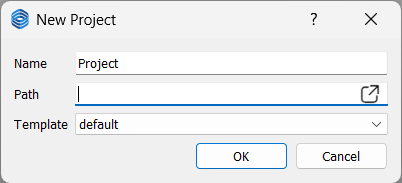

# Project Management
In eMotorSolution, due to complexity and large number of components, instead of a single monolithic file, projects are composed of multiple files and folders. This allows for better organization and management of the project. 

The structure of a project with two analyses is shown below:

```bash
project_root
├── project_name.json
└── Scripts
|   ├── ems.pyi
│   └── main.py
│── Mesh
|   ├── rotor.geo
|   ├── rotor.m
|   ├── rotor.neu
|   ├── stator.geo
|   ├── stator.m
|   └── stator.neu
│── analysis1
|   └── analysis1.json
└── analysis2
    └── analysis2.json
```
- `project_name.json`: This is the main project file that contains all the information about the project, including machine type, dimensions, materials, and many other parameters. It is the main entry point for the project that is written in JSON format. JSON is a lightweight data interchange format that is easy for humans to read and write, and easy for machines to parse and generate.
- `Scripts`: This folder contains all the Python scripts that are used inside the project. The `ems.pyi` file is a stub file that contains the type hints for the eMotorSolution library, `ems`. The `main.py` file is the main entry point for the scripting part of the project. Further details about this folder can be found in the [Script checkpoint](./script).
- `Mesh`: This folder contains all the mesh files that are used in the project generated by [Mesh checkpoint](./mesh). Stator and rotor mesh files are stored in three different formats: `.geo`, `.m`, and `.neu`. The `.geo` file is the geometry file that contains the geometry of the mesh in GMSH format. The `.neu` file that is generated by `.geo` file is the mesh file that contains the mesh in NEU format. The `.m` file is for internal use and is not meant to be modified by the user. 
- `analysis` folders: Each project can have multiple analyses, and each analysis is stored in a separate folder. Each analysis folder is meant to be self-contained and can be run independently of the other analyses by the `EMSolution` library, `pyemsol`. Each analysis folder contains the JSON format of `input_control` file that contains all the information about the analysis, including the type of analysis, the boundary conditions, the initial conditions, and the solver settings. After the analysis is run, the stator and rotor `.neu` files are copied from the `Mesh` folder if they are not already present in the analysis folder. The post-processing files are also stored in the analysis folder. 

## AppData
The settings, new project templates, temporary files, and other data that are used by the application are stored in the `AppData` folder. The location of this folder depends on the operating system:
- **Windows**: `C:\Users\<username>\AppData\Local\eMotorSolution`. This folder is hidden by default, so you may need to enable the option to show hidden files and folders in Windows Explorer. You can open the folder by typing `%localappdata%\eMotorSolution` in the address bar of Windows Explorer or in the Run dialog (Win + R).
- **Linux**: `/home/<username>/.eMotorSolution`

## New
Click on the <span style={{ fontFamily: 'Segoe Fluent Icons', fontSize: '1.0em' }}>&#xE8A5;</span>**New** button in the **File** menu to create a new project. 

This will open a dialog where you can specify the project name, project path, and the template to use for the new project. The project name and path are required fields, while the template is optional. If you do not specify a template, the default template will be used. This will create a folder with the project name in the specified path, and inside this folder, it will create the `project_name.json` file and the `Scripts` and `Mesh` folders. 
The default template is located in the `AppData` folder, and it is named `default.json`. 

<p class="ems"></p>

## Open
Click on the <span style={{ fontFamily: 'Segoe Fluent Icons', fontSize: '1.0em' }}>&#xE838;</span>**Open** button in the **File** menu to open an existing project.
This will open a dialog where you can select the project json file.

## Save
Click on the <span style={{ fontFamily: 'Segoe Fluent Icons', fontSize: '1.0em' }}>&#xE7C3;</span>**Save** button in the **File** menu to save the current project.

## Export
The <span style={{ fontFamily: 'Segoe Fluent Icons', fontSize: '1.0em' }}>&#xE792;</span>**Export** button in the **File** menu saves the current project as a zip file without the simulation results. This is useful for sharing the project with others or for archiving the project without minimal storage space. The zip file will contain the project folder, including the `project_name.json` file, the `Scripts` and `Mesh` folders, and the analysis folders, but it will not include any simulation results or temporary files.

## Save As Template
To save the current project as a template for the new project, click on the **Save As Template** button in the **File** menu. This will open a dialog where you can specify the template name. The template name is required, and it must be unique. The template will be saved in the `AppData` folder, and it will be available for use in the **New** project dialog.